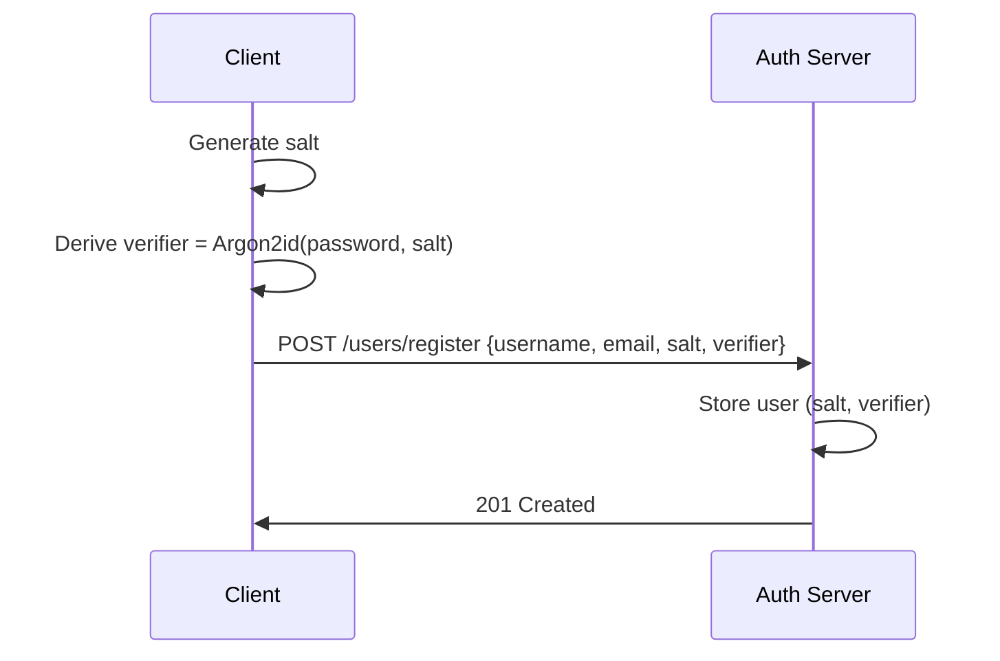
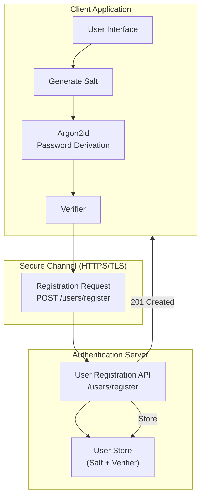

# User Registration and Login

## 1️⃣ User Registration Flow (Zero-Knowledge)

Password never leaves the client.

Algorithm:

```text
salt ← random(16 bytes)
verifier ← Argon2id(password, salt)
```

Stored:

```text
User {
  username,
  email,
  salt,
  password_verifier
}
```





---


## Prerequisites


## Getting Started

### Setting up environment

Initiate golang module for registration and login backend with the following command.

```bash
go mod init github.com/rabbicse/auth-service
```

Then install the following packages by the following commands.

```bash
go get -u github.com/gin-gonic/gin
``` 

Install uuid from.
```bash
go get github.com/google/uuid
```

For more details visit [gin-gonic](https://gin-gonic.com/en/docs/quickstart/)

### Project Structure
Create folder structure like the following structure.

```bash
cmd/
└── server/                Application entrypoint (composition root)

internal/
├── domain/                Pure business models
│   ├── client/
│   ├── user/
│   ├── authcode/
│   └── token/
│
├── application/           Use cases & protocol logic
│   ├── oauth/
│   └── oidc/
│
├── infrastructure/        Technical implementations
│   ├── jwt/
│   └── persistence/
│
├── interfaces/http/       HTTP layer (Gin)
│   ├── handlers/
│   ├── routes/
│   └── router.go
├── pkg
│
│
└── tests
```

## Development in golang
### Step 1: Basic server with gin-gonic
create `config.go` under `/internal/config/config.go` and write the following code.
```golang
package config

import "os"

type Config struct {
    Server ServerConfig
}

type ServerConfig struct {
    Host string
    Port string
}

func Load() *Config {
    return &Config{
        Server: ServerConfig{
            Host: getEnv("SERVER_HOST", "0.0.0.0"),
            Port: getEnv("SERVER_PORT", "8080"),
        },
    }
}

func getEnv(key, def string) string {
    if v := os.Getenv(key); v != "" {
        return v
    }
    return def
}
```

Then write the following http router under `/internal/interfaces/http/router.go` and write the following code.

```golang
package http

import "github.com/gin-gonic/gin"

func NewRouter() *gin.Engine {
    r := gin.New()

    r.Use(gin.Logger())
    r.Use(gin.Recovery())

    r.GET("/health", func(c *gin.Context) {
        c.JSON(200, gin.H{
            "status": "ok",
        })
    })

    return r
}
```

Then write the following code under `/cmd/server/main.go`

```golang
package main

import (
    "fmt"
    "log"

    "auth-service/internal/config"
    httpiface "auth-service/internal/interfaces/http"
)

func main() {
    // 1. Load configuration
    cfg := config.Load()

    // 2. Create HTTP router
    router := httpiface.NewRouter()

    // 3. Start server
    addr := fmt.Sprintf("%s:%s", cfg.Server.Host, cfg.Server.Port)

    log.Printf("Auth server running on %s", addr)
    if err := router.Run(addr); err != nil {
        log.Fatal(err)
    }
}
```

Run it by the following command on terminal.
```bash
go run ./cmd/server/main.go
```

Then run the following command on terminal to check health of server.
```bash
curl http://localhost:8080/health
```

It should return like the following output.
```bash
{"status":"ok"}   
```

## Step 2 - Domain Layer
### User Domain
under `/internal/domain/user/user.go` write the following code to register user.

```golang
package user

type User struct {
	ID               string
	Username         string
	Email            string
	Password         string
	IsVerified       bool
	Salt             []byte
	PasswordVerifier []byte // Argon2(password, salt)
}
```

Also define corresponding repository interface under `/internal/domain/user/user_repository.go`

with the following code
```golang
package user

import (
	"context"
)

type UserRepository interface {
	FindByID(ctx context.Context, id string) (*User, error)
	FindByEmail(ctx context.Context, email string) (*User, error)
	FindByUsername(username string) (*User, error)
	Save(u *User) error
}
```

Now it's time to implement user repository. For now creating in-memory repository. Later we'll implement with RDBMS or NoSql databases.

Create file at `/internal/infrastructure/persistence/memory/user_repository.go`

```golang
package memory

import (
	"context"
	"errors"
	"sync"

	"github.com/rabbicse/auth-service/internal/domain/common"
	"github.com/rabbicse/auth-service/internal/domain/user"
)

type UserRepository struct {
	mu    sync.RWMutex
	users map[string]*user.User
}

func NewUserRepository(seed []*user.User) *UserRepository {
	m := make(map[string]*user.User)
	for _, u := range seed {
		m[u.ID] = u
	}
	return &UserRepository{users: m}
}

func (r *UserRepository) FindByID(ctx context.Context, id string) (*user.User, error) {
	r.mu.RLock()
	defer r.mu.RUnlock()

	u, ok := r.users[id]
	if !ok {
		return nil, common.ErrNotFound
	}
	return u, nil
}

func (r *UserRepository) FindByEmail(ctx context.Context, email string) (*user.User, error) {
	r.mu.RLock()
	defer r.mu.RUnlock()

	for _, u := range r.users {
		if u.Email == email {
			return u, nil
		}
	}
	return nil, common.ErrNotFound
}

func (r *UserRepository) Save(u *user.User) error {
	r.mu.Lock()
	defer r.mu.Unlock()
	r.users[u.Username] = u

	return nil
}

func (r *UserRepository) FindByUsername(username string) (*user.User, error) {
	r.mu.Lock()
	defer r.mu.Unlock()
	u, ok := r.users[username]
	if !ok {
		return nil, errors.New("user not found")
	}
	return u, nil
}
```

Then create user registration service at `/internal/application/authentication/user_registration.go`

```golang
package authentication

import (
	"encoding/base64"
	"errors"

	"github.com/google/uuid"
	"github.com/rabbicse/auth-service/internal/domain/aggregates/user"
)

var ErrUserAlreadyExists = errors.New("user already exists")

type UserRegistrationService struct {
	repo user.Repository
}

func NewUserRegistrationService(repo user.Repository) *UserRegistrationService {
	return &UserRegistrationService{repo: repo}
}

func (s *UserRegistrationService) Register(username, email, saltB64, verifierB64 string) (*user.User, error) {
	if _, err := s.repo.FindByUsername(username); err == nil {
		return nil, ErrUserAlreadyExists
	}

	salt, err := base64.RawURLEncoding.DecodeString(saltB64)
	if err != nil {
		return nil, errors.New("invalid salt encoding")
	}

	verifier, err := base64.RawURLEncoding.DecodeString(verifierB64)
	if err != nil {
		return nil, errors.New("invalid verifier encoding")
	}

	u := &user.User{
		ID:               uuid.NewString(),
		Username:         username,
		Email:            email,
		Salt:             salt,
		PasswordVerifier: verifier,
		IsVerified:       true,
	}

	if err := s.repo.Save(u); err != nil {
		return nil, err
	}

	return u, nil
}
```

Under `/internal/shared/errors.go` write the following code.

```golang
package shared

import "errors"

var (
	ErrUserNotFound = errors.New("user not found")
)
```

Under `/internal/infrastructure/persistence/memory/user_repository.go` write the following code.

```golang
package memory

import (
	"context"
	"sync"

	"github.com/rabbicse/auth-service/internal/domain/aggregates/user"
	"github.com/rabbicse/auth-service/internal/shared"
)

type UserRepository struct {
	mu    sync.RWMutex
	users map[string]*user.User
}

func NewUserRepository(seed []*user.User) *UserRepository {
	m := make(map[string]*user.User)
	for _, u := range seed {
		m[u.ID] = u
	}
	return &UserRepository{users: m}
}

func (r *UserRepository) FindByID(ctx context.Context, id string) (*user.User, error) {
	r.mu.RLock()
	defer r.mu.RUnlock()

	u, ok := r.users[id]
	if !ok {
		return nil, shared.ErrUserNotFound
	}
	return u, nil
}

func (r *UserRepository) FindByEmail(ctx context.Context, email string) (*user.User, error) {
	r.mu.RLock()
	defer r.mu.RUnlock()

	for _, u := range r.users {
		if u.Email == email {
			return u, nil
		}
	}
	return nil, shared.ErrUserNotFound
}

func (r *UserRepository) Save(u *user.User) error {
	r.mu.Lock()
	defer r.mu.Unlock()
	r.users[u.Username] = u

	return nil
}

func (r *UserRepository) FindByUsername(username string) (*user.User, error) {
	r.mu.Lock()
	defer r.mu.Unlock()
	u, ok := r.users[username]
	if !ok {
		return nil, shared.ErrUserNotFound
	}
	return u, nil
}
```

Create `UserRegistrationRequest` DTO under `/internal/interfaces/http/dtos/registration_request.go`

```golang
package dtos

type UserRegistrationRequest struct {
	Username string `json:"username"`
	Email    string `json:"email"`
	Salt     string `json:"salt"`
	Verifier string `json:"verifier"`
}
```

Then write user registration handler under `/internal/interfaces/http/handlers/registration_handler.go`

```golang
package handlers

import (
	"net/http"

	"github.com/gin-gonic/gin"
	"github.com/rabbicse/auth-service/internal/application/authentication"
	"github.com/rabbicse/auth-service/internal/interfaces/http/dtos"
)

type RegisterHandler struct {
	svc *authentication.UserRegistrationService
}

func NewRegisterHandler(svc *authentication.UserRegistrationService) *RegisterHandler {
	return &RegisterHandler{svc: svc}
}

func (h *RegisterHandler) Register(c *gin.Context) {
	var req dtos.UserRegistrationRequest

	if err := c.BindJSON(&req); err != nil {
		c.JSON(http.StatusBadRequest, gin.H{"error": "invalid request"})
		return
	}

	u, err := h.svc.Register(req.Username, req.Email, req.Salt, req.Verifier)
	if err != nil {
		c.JSON(http.StatusConflict, gin.H{"error": err.Error()})
		return
	}

	c.JSON(http.StatusCreated, gin.H{
		"id":       u.ID,
		"username": u.Username,
	})
}
```

Add registration handler inside router.go by appending the following line.
```golang
r.POST("/users/register", registerHandler.Register)
```

So need to update function and final file will be look like.
```golang
package http

import (
	"github.com/gin-gonic/gin"
	"github.com/rabbicse/auth-service/internal/interfaces/http/handlers"
)

func NewRouter(registerHandler *handlers.RegisterHandler) *gin.Engine {
	r := gin.New()

	r.Use(gin.Logger())
	r.Use(gin.Recovery())

	r.GET("/health", func(c *gin.Context) {
		c.JSON(200, gin.H{
			"status": "ok",
		})
	})

	r.POST("/users/register", registerHandler.Register)

	return r
}
```

Finally update `main.go` by adding these lines and updating router initialization.
```golang
// Add user repository and registration service initialization here
userRepo := memory.NewUserRepository(nil) // No seed data, we will add users via registration
registrationService := authentication.NewUserRegistrationService(userRepo)

// Initialize registration handler with the service
registerHandler := handlers.NewRegisterHandler(registrationService)
```

```golang
router := httpiface.NewRouter(registerHandler)
```

Run application by

```bash
go run ./cmd/server
```

## Step 3 - Basic Crypto
```golang
package helpers

import (
	"crypto/hmac"
	"crypto/rand"
	"crypto/sha256"
	"encoding/base64"

	"golang.org/x/crypto/argon2"
)

// Generate SecureTokenString returns a cryptographically secure random string.
// 32 bytes = 256 bits of entropy (strong enough for tokens, IDs, challenges).
func GenerateSecureTokenString() string {
	b := make([]byte, 32)
	if _, err := rand.Read(b); err != nil {
		// crypto/rand should never fail under normal conditions
		panic("failed to generate secure random token: " + err.Error())
	}
	return base64.RawURLEncoding.EncodeToString(b)
}

func DeriveVerifier(password string, salt []byte) []byte {
	return argon2.IDKey([]byte(password), salt, 1, 64*1024, 4, 32)
}

func ComputeProof(verifier, challenge []byte) []byte {
	h := hmac.New(sha256.New, verifier)
	h.Write(challenge)
	return h.Sum(nil)
}

func RandomToken() string {
	b := make([]byte, 32)
	rand.Read(b)
	return base64.RawURLEncoding.EncodeToString(b)
}
```

## Step 4 - Testing application
Create new test to check user registration by the following code.

```golang
package tests

import (
	"bytes"
	"crypto/rand"
	"encoding/base64"
	"encoding/json"
	"net/http"
	"testing"

	"github.com/rabbicse/auth-service/pkg/helpers"
)

const BaseURLMfa = "http://localhost:8080"

func Test_Registration_Flow(t *testing.T) {
	username := "alice"
	password := "password123"
	email := "alice@example.com"

	// --------------------------------
	// 0. Client Registration
	// --------------------------------
	salt := make([]byte, 16)
	rand.Read(salt)
	verifier := helpers.DeriveVerifier(password, salt)

	regBody := map[string]string{
		"username": username,
		"email":    email,
		"salt":     base64.RawURLEncoding.EncodeToString(salt),
		"verifier": base64.RawURLEncoding.EncodeToString(verifier),
	}

	callJSON(t, "POST", "/users/register", regBody, nil)
}

func callJSON(t *testing.T, method, path string, body any, out any) {
	var buf bytes.Buffer
	if body != nil {
		json.NewEncoder(&buf).Encode(body)
	}

	req, err := http.NewRequest(method, BaseURLMfa+path, &buf)
	if err != nil {
		t.Fatal(err)
	}

	req.Header.Set("Content-Type", "application/json")

	resp, err := http.DefaultClient.Do(req)
	if err != nil {
		t.Fatal(err)
	}
	defer resp.Body.Close()

	if resp.StatusCode >= 400 {
		t.Fatalf("request %s %s failed: %d", method, path, resp.StatusCode)
	}

	if out != nil {
		json.NewDecoder(resp.Body).Decode(out)
	}
}
```

Then run the tests.

```bash
go test ./tests/registration_flow_test.go -v test
```