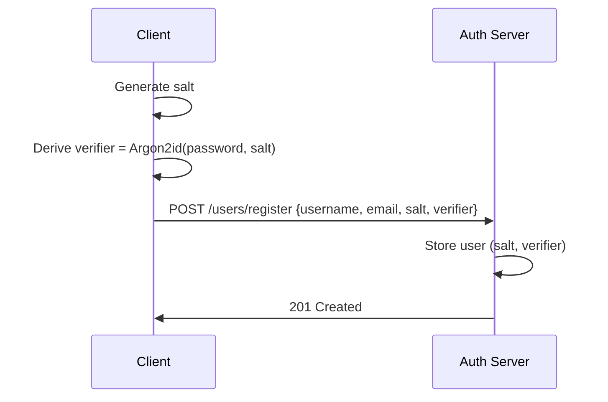
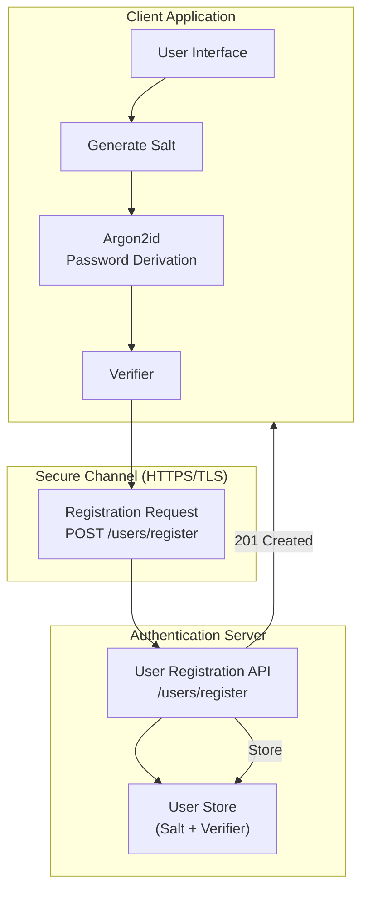
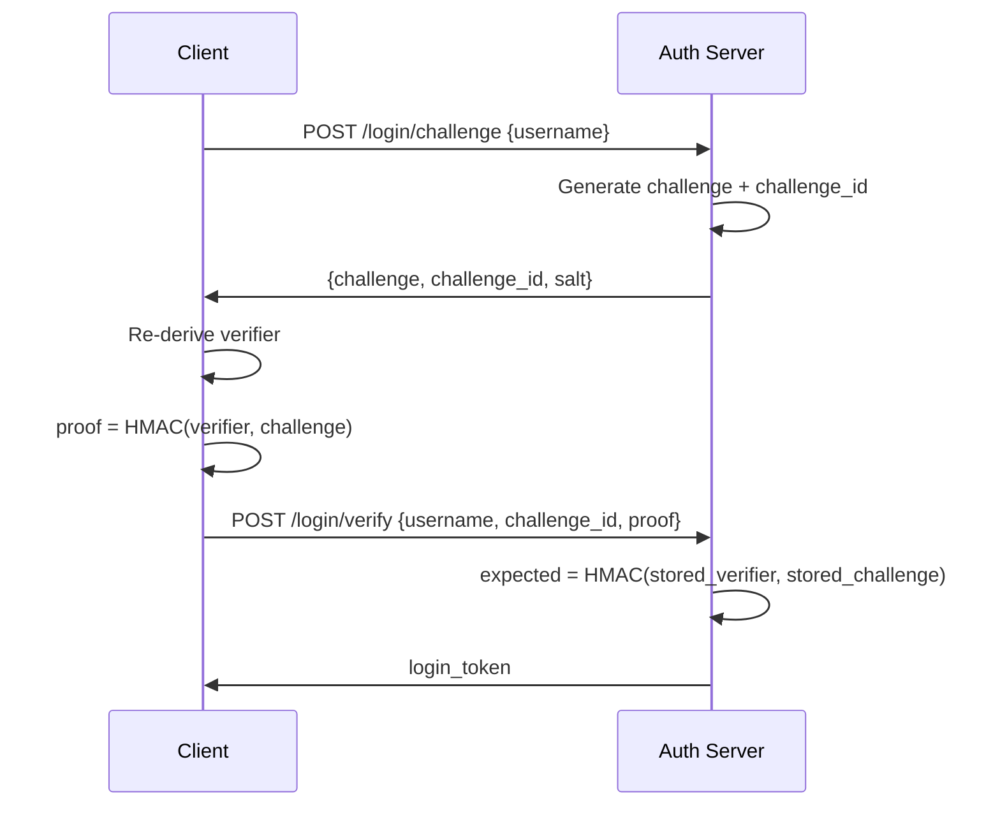

# User Registration and Login

## 1️⃣ User Registration Flow (Zero-Knowledge)

Password never leaves the client.

Algorithm:

```text
salt ← random(16 bytes)
verifier ← Argon2id(password, salt)
```

Stored:

```text
User {
  username,
  email,
  salt,
  password_verifier
}
```





---

## 2️⃣ Login Flow (Challenge–Response)

Algorithm:

```text
verifier ← Argon2id(password, salt)
proof ← HMAC(verifier, challenge)
```



Security:

- Password never transmitted  
- Proof is valid only once  
- Replay resistant  
- MITM safe  

---

## Prerequisites


## Getting Started

### Setting up environment

Initiate golang module for registration and login backend with the following command.

```bash
go mod init github.com/rabbicse/auth-service
```

Then install the following packages by the following commands.

```bash
go get -u github.com/gin-gonic/gin
``` 

For more details visit [gin-gonic](https://gin-gonic.com/en/docs/quickstart/)

### Project Structure
Create folder structure like the following structure.

```bash
cmd/
└── server/                Application entrypoint (composition root)

internal/
├── domain/                Pure business models
│   ├── client/
│   ├── user/
│   ├── authcode/
│   └── token/
│
├── application/           Use cases & protocol logic
│   ├── oauth/
│   └── oidc/
│
├── infrastructure/        Technical implementations
│   ├── jwt/
│   └── persistence/
│
├── interfaces/http/       HTTP layer (Gin)
│   ├── handlers/
│   ├── routes/
│   └── router.go
├── pkg
│
│
└── tests
```

## Development in golang
### Step 1: Basic server with gin-gonic
create `config.go` under `/internal/config/config.go` and write the following code.
```golang
package config

import "os"

type Config struct {
    Server ServerConfig
}

type ServerConfig struct {
    Host string
    Port string
}

func Load() *Config {
    return &Config{
        Server: ServerConfig{
            Host: getEnv("SERVER_HOST", "0.0.0.0"),
            Port: getEnv("SERVER_PORT", "8080"),
        },
    }
}

func getEnv(key, def string) string {
    if v := os.Getenv(key); v != "" {
        return v
    }
    return def
}
```

Then write the following http router under `/internal/interfaces/http/router.go` and write the following code.

```golang
package http

import "github.com/gin-gonic/gin"

func NewRouter() *gin.Engine {
    r := gin.New()

    r.Use(gin.Logger())
    r.Use(gin.Recovery())

    r.GET("/health", func(c *gin.Context) {
        c.JSON(200, gin.H{
            "status": "ok",
        })
    })

    return r
}
```

Then write the following code under `/cmd/server/main.go`

```golang
package main

import (
    "fmt"
    "log"

    "auth-service/internal/config"
    httpiface "auth-service/internal/interfaces/http"
)

func main() {
    // 1. Load configuration
    cfg := config.Load()

    // 2. Create HTTP router
    router := httpiface.NewRouter()

    // 3. Start server
    addr := fmt.Sprintf("%s:%s", cfg.Server.Host, cfg.Server.Port)

    log.Printf("Auth server running on %s", addr)
    if err := router.Run(addr); err != nil {
        log.Fatal(err)
    }
}
```

Run it by the following command on terminal.
```bash
go run ./cmd/server/main.go
```

Then run the following command on terminal to check health of server.
```bash
curl http://localhost:8080/health
```

It should return like the following output.
```bash
{"status":"ok"}   
```

## Step 2 - Domain Layer
### User Domain
under `/internal/domain/user/user.go` write the following code to register user.

```golang
package user

type User struct {
	ID               string
	Username         string
	Email            string
	Password         string
	IsVerified       bool
	Salt             []byte
	PasswordVerifier []byte // Argon2(password, salt)
}
```

Also define corresponding repository interface under `/internal/domain/user/user_repository.go`

with the following code
```golang
package user

import (
	"context"
)

type Repository interface {
	FindByID(ctx context.Context, id string) (*User, error)
	FindByEmail(ctx context.Context, email string) (*User, error)
	FindByUsername(username string) (*User, error)
	Save(u *User) error
}
```