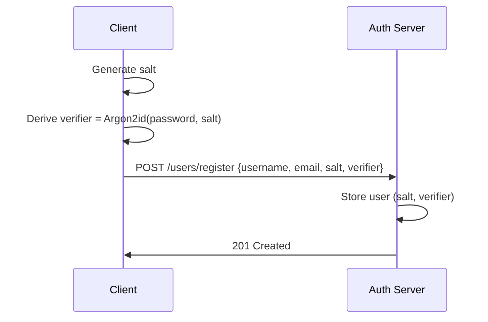
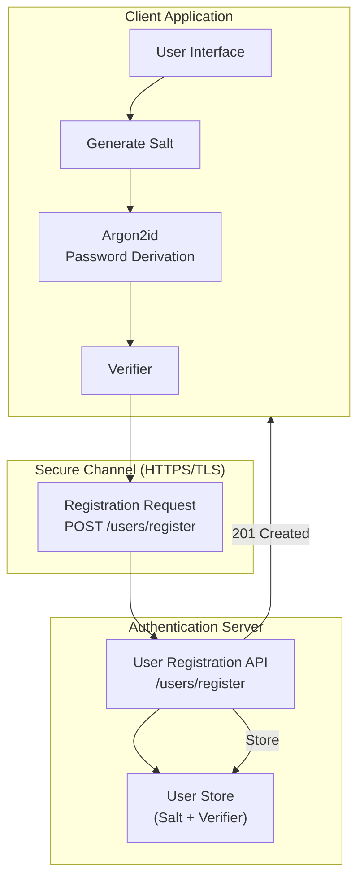
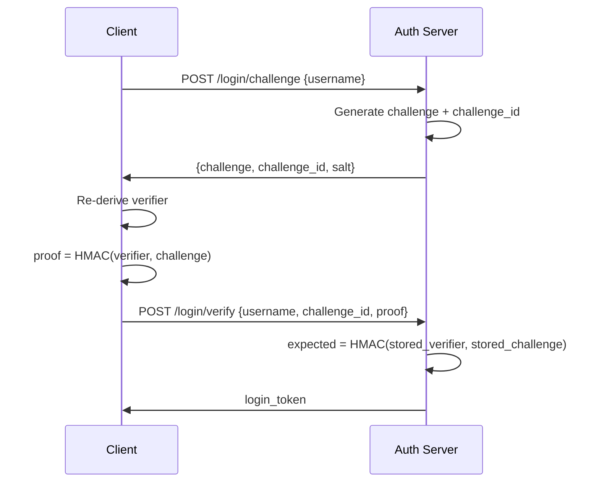

# User Registration and Login

## 1️⃣ User Registration Flow (Zero-Knowledge)

Password never leaves the client.

Algorithm:

```text
salt ← random(16 bytes)
verifier ← Argon2id(password, salt)
```

Stored:

```text
User {
  username,
  email,
  salt,
  password_verifier
}
```





---


## Prerequisites


## Getting Started

### Setting up environment

Initiate golang module for registration and login backend with the following command.

```bash
go mod init github.com/rabbicse/auth-service
```

Then install the following packages by the following commands.

```bash
go get -u github.com/gin-gonic/gin
``` 

Install uuid from.
```bash
go get github.com/google/uuid
```

For more details visit [gin-gonic](https://gin-gonic.com/en/docs/quickstart/)

### Project Structure
Create folder structure like the following structure.

```bash
cmd/
└── server/                Application entrypoint (composition root)

internal/
├── domain/                Pure business models
│   ├── client/
│   ├── user/
│   ├── authcode/
│   └── token/
│
├── application/           Use cases & protocol logic
│   ├── oauth/
│   └── oidc/
│
├── infrastructure/        Technical implementations
│   ├── jwt/
│   └── persistence/
│
├── interfaces/http/       HTTP layer (Gin)
│   ├── handlers/
│   ├── routes/
│   └── router.go
├── pkg
│
│
└── tests
```

## Development in golang
### Step 1: Basic server with gin-gonic
create `config.go` under `/internal/config/config.go` and write the following code.
```golang
package config

import "os"

type Config struct {
    Server ServerConfig
}

type ServerConfig struct {
    Host string
    Port string
}

func Load() *Config {
    return &Config{
        Server: ServerConfig{
            Host: getEnv("SERVER_HOST", "0.0.0.0"),
            Port: getEnv("SERVER_PORT", "8080"),
        },
    }
}

func getEnv(key, def string) string {
    if v := os.Getenv(key); v != "" {
        return v
    }
    return def
}
```

Then write the following http router under `/internal/interfaces/http/router.go` and write the following code.

```golang
package http

import "github.com/gin-gonic/gin"

func NewRouter() *gin.Engine {
    r := gin.New()

    r.Use(gin.Logger())
    r.Use(gin.Recovery())

    r.GET("/health", func(c *gin.Context) {
        c.JSON(200, gin.H{
            "status": "ok",
        })
    })

    return r
}
```

Then write the following code under `/cmd/server/main.go`

```golang
package main

import (
    "fmt"
    "log"

    "auth-service/internal/config"
    httpiface "auth-service/internal/interfaces/http"
)

func main() {
    // 1. Load configuration
    cfg := config.Load()

    // 2. Create HTTP router
    router := httpiface.NewRouter()

    // 3. Start server
    addr := fmt.Sprintf("%s:%s", cfg.Server.Host, cfg.Server.Port)

    log.Printf("Auth server running on %s", addr)
    if err := router.Run(addr); err != nil {
        log.Fatal(err)
    }
}
```

Run it by the following command on terminal.
```bash
go run ./cmd/server/main.go
```

Then run the following command on terminal to check health of server.
```bash
curl http://localhost:8080/health
```

It should return like the following output.
```bash
{"status":"ok"}   
```

## Step 2 - Domain Layer
### User Domain
under `/internal/domain/user/user.go` write the following code to register user.

```golang
package user

type User struct {
	ID               string
	Username         string
	Email            string
	Password         string
	IsVerified       bool
	Salt             []byte
	PasswordVerifier []byte // Argon2(password, salt)
}
```

Also define corresponding repository interface under `/internal/domain/user/user_repository.go`

with the following code
```golang
package user

import (
	"context"
)

type UserRepository interface {
	FindByID(ctx context.Context, id string) (*User, error)
	FindByEmail(ctx context.Context, email string) (*User, error)
	FindByUsername(username string) (*User, error)
	Save(u *User) error
}
```

Now it's time to implement user repository. For now creating in-memory repository. Later we'll implement with RDBMS or NoSql databases.

Create file at `/internal/infrastructure/persistence/memory/user_repository.go`

```golang
package memory

import (
	"context"
	"errors"
	"sync"

	"github.com/rabbicse/auth-service/internal/domain/common"
	"github.com/rabbicse/auth-service/internal/domain/user"
)

type UserRepository struct {
	mu    sync.RWMutex
	users map[string]*user.User
}

func NewUserRepository(seed []*user.User) *UserRepository {
	m := make(map[string]*user.User)
	for _, u := range seed {
		m[u.ID] = u
	}
	return &UserRepository{users: m}
}

func (r *UserRepository) FindByID(ctx context.Context, id string) (*user.User, error) {
	r.mu.RLock()
	defer r.mu.RUnlock()

	u, ok := r.users[id]
	if !ok {
		return nil, common.ErrNotFound
	}
	return u, nil
}

func (r *UserRepository) FindByEmail(ctx context.Context, email string) (*user.User, error) {
	r.mu.RLock()
	defer r.mu.RUnlock()

	for _, u := range r.users {
		if u.Email == email {
			return u, nil
		}
	}
	return nil, common.ErrNotFound
}

func (r *UserRepository) Save(u *user.User) error {
	r.mu.Lock()
	defer r.mu.Unlock()
	r.users[u.Username] = u

	return nil
}

func (r *UserRepository) FindByUsername(username string) (*user.User, error) {
	r.mu.Lock()
	defer r.mu.Unlock()
	u, ok := r.users[username]
	if !ok {
		return nil, errors.New("user not found")
	}
	return u, nil
}
```

Then create user registration service at `/internal/application/authentication/user_registration.go`

```golang
package authentication

import (
	"encoding/base64"
	"errors"

	"github.com/google/uuid"
	"github.com/rabbicse/auth-service/internal/domain/aggregates/user"
)

var ErrUserAlreadyExists = errors.New("user already exists")

type UserRegistrationService struct {
	repo user.Repository
}

func NewUserRegistrationService(repo user.Repository) *UserRegistrationService {
	return &UserRegistrationService{repo: repo}
}

func (s *UserRegistrationService) Register(username, email, saltB64, verifierB64 string) (*user.User, error) {
	if _, err := s.repo.FindByUsername(username); err == nil {
		return nil, ErrUserAlreadyExists
	}

	salt, err := base64.RawURLEncoding.DecodeString(saltB64)
	if err != nil {
		return nil, errors.New("invalid salt encoding")
	}

	verifier, err := base64.RawURLEncoding.DecodeString(verifierB64)
	if err != nil {
		return nil, errors.New("invalid verifier encoding")
	}

	u := &user.User{
		ID:               uuid.NewString(),
		Username:         username,
		Email:            email,
		Salt:             salt,
		PasswordVerifier: verifier,
		IsVerified:       true,
	}

	if err := s.repo.Save(u); err != nil {
		return nil, err
	}

	return u, nil
}
```

Under `/internal/shared/errors.go` write the following code.

```golang
package shared

import "errors"

var (
	ErrUserNotFound = errors.New("user not found")
)
```

Under `/internal/infrastructure/persistence/memory/user_repository.go` write the following code.

```golang
package memory

import (
	"context"
	"sync"

	"github.com/rabbicse/auth-service/internal/domain/aggregates/user"
	"github.com/rabbicse/auth-service/internal/shared"
)

type UserRepository struct {
	mu    sync.RWMutex
	users map[string]*user.User
}

func NewUserRepository(seed []*user.User) *UserRepository {
	m := make(map[string]*user.User)
	for _, u := range seed {
		m[u.ID] = u
	}
	return &UserRepository{users: m}
}

func (r *UserRepository) FindByID(ctx context.Context, id string) (*user.User, error) {
	r.mu.RLock()
	defer r.mu.RUnlock()

	u, ok := r.users[id]
	if !ok {
		return nil, shared.ErrUserNotFound
	}
	return u, nil
}

func (r *UserRepository) FindByEmail(ctx context.Context, email string) (*user.User, error) {
	r.mu.RLock()
	defer r.mu.RUnlock()

	for _, u := range r.users {
		if u.Email == email {
			return u, nil
		}
	}
	return nil, shared.ErrUserNotFound
}

func (r *UserRepository) Save(u *user.User) error {
	r.mu.Lock()
	defer r.mu.Unlock()
	r.users[u.Username] = u

	return nil
}

func (r *UserRepository) FindByUsername(username string) (*user.User, error) {
	r.mu.Lock()
	defer r.mu.Unlock()
	u, ok := r.users[username]
	if !ok {
		return nil, shared.ErrUserNotFound
	}
	return u, nil
}
```

Create `UserRegistrationRequest` DTO under `/internal/interfaces/http/dtos/registration_request.go`

```golang
package dtos

type UserRegistrationRequest struct {
	Username string `json:"username"`
	Email    string `json:"email"`
	Salt     string `json:"salt"`
	Verifier string `json:"verifier"`
}
```

Then write user registration handler under `/internal/interfaces/http/handlers/registration_handler.go`

```golang
package handlers

import (
	"net/http"

	"github.com/gin-gonic/gin"
	"github.com/rabbicse/auth-service/internal/application/authentication"
	"github.com/rabbicse/auth-service/internal/interfaces/http/dtos"
)

type RegisterHandler struct {
	svc *authentication.UserRegistrationService
}

func NewRegisterHandler(svc *authentication.UserRegistrationService) *RegisterHandler {
	return &RegisterHandler{svc: svc}
}

func (h *RegisterHandler) Register(c *gin.Context) {
	var req dtos.UserRegistrationRequest

	if err := c.BindJSON(&req); err != nil {
		c.JSON(http.StatusBadRequest, gin.H{"error": "invalid request"})
		return
	}

	u, err := h.svc.Register(req.Username, req.Email, req.Salt, req.Verifier)
	if err != nil {
		c.JSON(http.StatusConflict, gin.H{"error": err.Error()})
		return
	}

	c.JSON(http.StatusCreated, gin.H{
		"id":       u.ID,
		"username": u.Username,
	})
}
```

Add registration handler inside router.go by appending the following line.
```golang
r.POST("/users/register", registerHandler.Register)
```

So need to update function and final file will be look like.
```golang
package http

import (
	"github.com/gin-gonic/gin"
	"github.com/rabbicse/auth-service/internal/interfaces/http/handlers"
)

func NewRouter(registerHandler *handlers.RegisterHandler) *gin.Engine {
	r := gin.New()

	r.Use(gin.Logger())
	r.Use(gin.Recovery())

	r.GET("/health", func(c *gin.Context) {
		c.JSON(200, gin.H{
			"status": "ok",
		})
	})

	r.POST("/users/register", registerHandler.Register)

	return r
}
```

Finally update `main.go` by adding these lines and updating router initialization.
```golang
// Add user repository and registration service initialization here
userRepo := memory.NewUserRepository(nil) // No seed data, we will add users via registration
registrationService := authentication.NewUserRegistrationService(userRepo)

// Initialize registration handler with the service
registerHandler := handlers.NewRegisterHandler(registrationService)
```

```golang
router := httpiface.NewRouter(registerHandler)
```

Run application by

```bash
go run ./cmd/server
```

## Step 3 - Basic Crypto
```golang
package helpers

import (
	"crypto/hmac"
	"crypto/rand"
	"crypto/sha256"
	"encoding/base64"

	"golang.org/x/crypto/argon2"
)

// Generate SecureTokenString returns a cryptographically secure random string.
// 32 bytes = 256 bits of entropy (strong enough for tokens, IDs, challenges).
func GenerateSecureTokenString() string {
	b := make([]byte, 32)
	if _, err := rand.Read(b); err != nil {
		// crypto/rand should never fail under normal conditions
		panic("failed to generate secure random token: " + err.Error())
	}
	return base64.RawURLEncoding.EncodeToString(b)
}

func DeriveVerifier(password string, salt []byte) []byte {
	return argon2.IDKey([]byte(password), salt, 1, 64*1024, 4, 32)
}

func ComputeProof(verifier, challenge []byte) []byte {
	h := hmac.New(sha256.New, verifier)
	h.Write(challenge)
	return h.Sum(nil)
}

func RandomToken() string {
	b := make([]byte, 32)
	rand.Read(b)
	return base64.RawURLEncoding.EncodeToString(b)
}
```

## Step 4 - Testing application
Create new test to check user registration by the following code.

```golang
package tests

import (
	"bytes"
	"crypto/rand"
	"encoding/base64"
	"encoding/json"
	"net/http"
	"testing"

	"github.com/rabbicse/auth-service/pkg/helpers"
)

const BaseURLMfa = "http://localhost:8080"

func Test_Registration_Flow(t *testing.T) {
	username := "alice"
	password := "password123"
	email := "alice@example.com"

	// --------------------------------
	// 0. Client Registration
	// --------------------------------
	salt := make([]byte, 16)
	rand.Read(salt)
	verifier := helpers.DeriveVerifier(password, salt)

	regBody := map[string]string{
		"username": username,
		"email":    email,
		"salt":     base64.RawURLEncoding.EncodeToString(salt),
		"verifier": base64.RawURLEncoding.EncodeToString(verifier),
	}

	callJSON(t, "POST", "/users/register", regBody, nil)
}

func callJSON(t *testing.T, method, path string, body any, out any) {
	var buf bytes.Buffer
	if body != nil {
		json.NewEncoder(&buf).Encode(body)
	}

	req, err := http.NewRequest(method, BaseURLMfa+path, &buf)
	if err != nil {
		t.Fatal(err)
	}

	req.Header.Set("Content-Type", "application/json")

	resp, err := http.DefaultClient.Do(req)
	if err != nil {
		t.Fatal(err)
	}
	defer resp.Body.Close()

	if resp.StatusCode >= 400 {
		t.Fatalf("request %s %s failed: %d", method, path, resp.StatusCode)
	}

	if out != nil {
		json.NewDecoder(resp.Body).Decode(out)
	}
}
```

Then run the tests.

```bash
go test ./tests/registration_flow_test.go -v test
```


---


## 1️⃣ User Login Flow (Zero-Knowledge)
This document guides you through implementing the Zero-Knowledge Login Flow for your auth service.

In this flow:
- The password never leaves the client
- The server issues a challenge
- The client responds with a cryptographic proof
- The server verifies the proof
- If correct → user is authenticated

This design prevents:
- Password exposure
- Replay attacks
- Server-side password leaks

### How the Login Flow Works
1.	Client sends login request with just the username
2.	Server returns:
    - a random challenge
	- the user’s salt
	- a unique challenge ID
3.	Client re-derives the verifier using Argon2id
4.	Client computes proof = HMAC(verifier, challenge)
5.	Client sends:
	- username
	- challenge_id
	- proof
6.	Server verifies proof using stored verifier
7.	If valid, server issues a login token

### Algorithm
```
verifier ← Argon2id(password, salt)
proof ← HMAC(verifier, challenge)
```



## Development
### Domain Layer

#### Login Challenge

add `/internal/domain/aggregates/authentication/login_challenge.go`

```golang
package authentication

import "time"

type LoginChallenge struct {
	ID        string
	UserID    string
	Value     []byte
	ExpiresAt time.Time
	Used      bool
}

func (c *LoginChallenge) IsExpired(now time.Time) bool {
	return now.After(c.ExpiresAt)
}
```

Add repository interface under `/internal/domain/aggregates/authentication/login_challenge_repository.go`
```golang
package authentication

type Repository interface {
	Save(*LoginChallenge) error
	Find(string) (*LoginChallenge, error)
	MarkUsed(string) error
}
```

Add login service at `/internal/application/authentication/login_service.go`
```golang
package authentication

import (
	"crypto/rand"
	"errors"
	"log"
	"time"

	"crypto/hmac"

	authDomain "github.com/rabbicse/auth-service/internal/domain/aggregates/authentication"
	"github.com/rabbicse/auth-service/internal/domain/aggregates/user"
	"github.com/rabbicse/auth-service/pkg/helpers"
)

var (
	ErrInvalidCredentials = errors.New("invalid credentials")
	ErrInvalidProof       = errors.New("invalid proof")
)

type LoginService struct {
	userRepo      user.UserRepository
	challengeRepo authDomain.LoginChallengeRepository
	// loginTokenService *LoginTokenService
}

func NewLoginService(
	userRepo user.UserRepository,
	challengeRepo authDomain.LoginChallengeRepository,
	// loginTokenService *LoginTokenService,
) *LoginService {
	return &LoginService{
		userRepo:      userRepo,
		challengeRepo: challengeRepo,
	}
}

func (s *LoginService) Start(username string) (*authDomain.LoginChallenge, []byte, error) {
	log.Println("LOGIN SERVICE START CALLED")

	u, err := s.userRepo.FindByUsername(username)
	if err != nil {
		return nil, nil, ErrInvalidCredentials
	}

	rawChallenge := make([]byte, 32)
	rand.Read(rawChallenge)

	c := &authDomain.LoginChallenge{
		ID:        helpers.GenerateSecureTokenString(),
		UserID:    u.ID,
		Value:     rawChallenge,
		ExpiresAt: time.Now().Add(2 * time.Minute),
		Used:      false,
	}

	log.Println("ABOUT TO SAVE CHALLENGE:", c.ID)
	s.challengeRepo.Save(c)
	log.Println("CHALLENGE SAVED")

	return c, u.Salt, nil
}

func (s *LoginService) Verify(username, challengeID string, proof []byte) (string, error) {
	u, err := s.userRepo.FindByUsername(username)
	if err != nil {
		return "", ErrInvalidCredentials
	}
	log.Printf("Found user: %+v\n", u)

	c, err := s.challengeRepo.Find(challengeID)
	if err != nil || c.Used || c.IsExpired(time.Now()) {
		return "", ErrInvalidCredentials
	}
	log.Printf("Challenge found: %v\n", c.ID)

	log.Printf("SERVER salt (hex): %x", u.Salt)
	log.Printf("SERVER challenge (hex): %x", c.Value)
	log.Printf("SERVER verifier (hex): %x", u.PasswordVerifier)

	expected := helpers.ComputeProof(u.PasswordVerifier, c.Value)
	log.Printf("SERVER expected proof (hex): %x", expected)

	// expected := helpers.ComputeProof(u.PasswordVerifier, c.Value)
	if !hmac.Equal(expected, proof) {
		return "", ErrInvalidCredentials
	}

	s.challengeRepo.MarkUsed(challengeID)

	// return s.loginTokenService.Issue(u.ID)
	return helpers.RandomToken(), nil
}
```

Update infra at `/internal/infrastructure/memory/login_challenge_repository.go`
```golang
package memory

import (
	"errors"
	"log"
	"sync"
	authDomain "github.com/rabbicse/auth-service/internal/domain/aggregates/authentication"
)

type ChallengeRepo struct {
	mu sync.Mutex
	m  map[string]*authDomain.LoginChallenge
}

func NewChallengeRepo() *ChallengeRepo {
	return &ChallengeRepo{m: map[string]*authDomain.LoginChallenge{}}
}

func (r *ChallengeRepo) Save(c *authDomain.LoginChallenge) {
	r.mu.Lock()
	defer r.mu.Unlock()
	log.Println("CHALLENGE SAVED:", c.ID)
	r.m[c.ID] = c
}

func (r *ChallengeRepo) Find(id string) (*authDomain.LoginChallenge, error) {
	r.mu.Lock()
	defer r.mu.Unlock()
	log.Println("CHALLENGE LOOKUP:", id)
	c, ok := r.m[id]
	if !ok {
		log.Println("CHALLENGE NOT FOUND")
		return nil, errors.New("not found")
	}
	return c, nil
}

func (r *ChallengeRepo) MarkUsed(id string) {
	r.mu.Lock()
	defer r.mu.Unlock()
	r.m[id].Used = true
}
```

Now add login handler at `/internal/interfaces/http/handlers/login_handler.go`
```golang
package handlers

import (
	"encoding/base64"
	"log"

	"github.com/gin-gonic/gin"
	"github.com/rabbicse/auth-service/internal/application/authentication"
)

type LoginHandler struct {
	svc *authentication.LoginService
}

func NewLoginHandler(svc *authentication.LoginService) *LoginHandler {
	return &LoginHandler{svc}
}

func (h *LoginHandler) Start(c *gin.Context) {
	log.Println("LOGIN HANDLER START CALLED")

	var req struct {
		Username string `json:"username"`
	}
	if err := c.BindJSON(&req); err != nil {
		log.Println("BIND ERROR:", err)
		c.JSON(400, gin.H{"error": "bad request"})
		return
	}

	log.Println("USERNAME RECEIVED:", req.Username)

	chal, salt, err := h.svc.Start(req.Username)
	if err != nil {
		log.Println("LOGIN SERVICE START FAILED:", err)
		c.JSON(401, gin.H{"error": "invalid user"})
		return
	}

	c.JSON(200, gin.H{
		"challenge_id": chal.ID,
		"challenge":    base64.RawURLEncoding.EncodeToString(chal.Value),
		"salt":         base64.RawURLEncoding.EncodeToString(salt),
	})
}

func (h *LoginHandler) Verify(c *gin.Context) {
	log.Println("LOGIN VERIFY HANDLER CALLED")

	var req struct {
		Username    string `json:"username"`
		ChallengeID string `json:"challenge_id"`
		Proof       string `json:"proof"`
	}

	if err := c.BindJSON(&req); err != nil {
		log.Println("BIND ERROR:", err)
		c.JSON(400, gin.H{"error": "bad request"})
		return
	}

	log.Printf("REQUEST: %+v\n", req)

	proof, err := base64.RawURLEncoding.DecodeString(req.Proof)
	if err != nil {
		log.Println("PROOF BASE64 DECODE FAILED:", err)
		c.JSON(400, gin.H{"error": "invalid proof encoding"})
		return
	}

	loginToken, err := h.svc.Verify(req.Username, req.ChallengeID, proof)
	if err != nil {
		c.JSON(401, gin.H{"error": "invalid login"})
		return
	}

	c.JSON(200, gin.H{"login_token": loginToken})
}
```

Now add to router.go.

```golang
	r.POST("/login/challenge", loginHandler.Start)
	r.POST("/login/verify", loginHandler.Verify)
```

So router will be look like the following.
```golang
package http

import (
	"github.com/gin-gonic/gin"
	"github.com/rabbicse/auth-service/internal/interfaces/http/handlers"
)

func NewRouter(
	registerHandler *handlers.RegisterHandler,
	loginHandler *handlers.LoginHandler) *gin.Engine {
	r := gin.New()

	r.Use(gin.Logger())
	r.Use(gin.Recovery())

	r.GET("/health", func(c *gin.Context) {
		c.JSON(200, gin.H{
			"status": "ok",
		})
	})

	// User registration route
	r.POST("/users/register", registerHandler.Register)

	// Login routes
	r.POST("/login/challenge", loginHandler.Start)
	r.POST("/login/verify", loginHandler.Verify)

	return r
}
```

Add these lines to `main.go`
```golang
// Initialize login service and handler
challengeRepo := memory.NewLoginChallengeRepo()
loginService := authentication.NewLoginService(userRepo, challengeRepo)
loginHandler := handlers.NewLoginHandler(loginService)
```

So final `main.go` file will be:
```golang
package main

import (
	"fmt"
	"log"

	"github.com/rabbicse/auth-service/internal/application/authentication"
	"github.com/rabbicse/auth-service/internal/config"
	"github.com/rabbicse/auth-service/internal/infrastructure/persistence/memory"
	httpiface "github.com/rabbicse/auth-service/internal/interfaces/http"
	"github.com/rabbicse/auth-service/internal/interfaces/http/handlers"
)

func main() {
	// 1. Load configuration
	cfg := config.Load()

	// Add user repository and registration service initialization here
	userRepo := memory.NewUserRepository(nil) // No seed data, we will add users via registration
	registrationService := authentication.NewUserRegistrationService(userRepo)

	// Initialize registration handler with the service
	registerHandler := handlers.NewRegisterHandler(registrationService)

	// Initialize login service and handler
	challengeRepo := memory.NewLoginChallengeRepo()
	loginService := authentication.NewLoginService(userRepo, challengeRepo)
	loginHandler := handlers.NewLoginHandler(loginService)

	// 2. Create HTTP router
	router := httpiface.NewRouter(registerHandler, loginHandler)

	// 3. Start server
	addr := fmt.Sprintf("%s:%s", cfg.Server.Host, cfg.Server.Port)

	log.Printf("Auth server running on %s", addr)
	if err := router.Run(addr); err != nil {
		log.Fatal(err)
	}
}
```

## Test the application
Finally test application by the following test code.
```golang
package tests

import (
	"bytes"
	"crypto/hmac"
	"crypto/rand"
	"crypto/sha256"
	"encoding/base64"
	"encoding/json"
	"io"
	"net/http"
	"testing"

	"golang.org/x/crypto/argon2"
)

const (
	BaseURL = "http://localhost:8080"
)

func Test_Login_Flow(t *testing.T) {
	username := "alice"
	password := "password123"
	email := "alice@example.com"

	t.Log("================================")
	t.Log("0. Client-side Registration")
	t.Log("================================")

	// Generate salt
	salt := make([]byte, 16)
	if _, err := rand.Read(salt); err != nil {
		t.Fatal(err)
	}

	// Derive verifier (Argon2id)
	verifier := argon2.IDKey([]byte(password), salt, 1, 64*1024, 4, 32)

	regBody := map[string]string{
		"username": username,
		"email":    email,
		"salt":     base64.RawURLEncoding.EncodeToString(salt),
		"verifier": base64.RawURLEncoding.EncodeToString(verifier),
	}

	callApi(t, "POST", "/users/register", regBody, nil)
	t.Log("User registered")

	// -------------------------------------------------------

	t.Log("================================")
	t.Log("1. Request Login Challenge")
	t.Log("================================")

	var chal struct {
		ChallengeID string `json:"challenge_id"`
		Challenge   string `json:"challenge"`
		Salt        string `json:"salt"`
	}

	callApi(t, "POST", "/login/challenge",
		map[string]string{"username": username},
		&chal,
	)

	if chal.ChallengeID == "" || chal.Challenge == "" || chal.Salt == "" {
		t.Fatal("Invalid challenge response from server")
	}

	t.Logf("Challenge ID: %s", chal.ChallengeID)

	// -------------------------------------------------------

	t.Log("================================")
	t.Log("2. Decode Base64URL")
	t.Log("================================")

	saltSrv, err := base64.RawURLEncoding.DecodeString(chal.Salt)
	if err != nil {
		t.Fatal(err)
	}

	challenge, err := base64.RawURLEncoding.DecodeString(chal.Challenge)
	if err != nil {
		t.Fatal(err)
	}

	// -------------------------------------------------------

	t.Log("================================")
	t.Log("3. Re-Derive Verifier")
	t.Log("================================")

	verifier2 := argon2.IDKey([]byte(password), saltSrv, 1, 64*1024, 4, 32)

	// -------------------------------------------------------

	t.Log("================================")
	t.Log("4. Compute Proof = HMAC(verifier, challenge)")
	t.Log("================================")

	mac := hmac.New(sha256.New, verifier2)
	mac.Write(challenge)
	proof := mac.Sum(nil)

	proofB64 := base64.RawURLEncoding.EncodeToString(proof)
	t.Logf("Proof: %s", proofB64)

	// -------------------------------------------------------

	t.Log("================================")
	t.Log("5. Verify Login")
	t.Log("================================")

	verifyBody := map[string]string{
		"username":     username,
		"challenge_id": chal.ChallengeID,
		"proof":        proofB64,
	}

	var verifyResp map[string]any
	callApi(t, "POST", "/login/verify", verifyBody, &verifyResp)

	t.Log("Server response:", verifyResp)
}

func callApi(t *testing.T, method, path string, body any, out any) {
	var buf bytes.Buffer
	if body != nil {
		json.NewEncoder(&buf).Encode(body)
	}

	req, err := http.NewRequest(method, BaseURL+path, &buf)
	if err != nil {
		t.Fatal(err)
	}

	req.Header.Set("Content-Type", "application/json")

	resp, err := http.DefaultClient.Do(req)
	if err != nil {
		t.Fatal(err)
	}
	defer resp.Body.Close()

	if resp.StatusCode >= 400 {
		b, _ := io.ReadAll(resp.Body)
		t.Fatalf("request %s %s failed: %d\n%s", method, path, resp.StatusCode, string(b))
	}

	if out != nil {
		json.NewDecoder(resp.Body).Decode(out)
	}
}
```

Then run the following command to test registration and login flow together.
```bash
go test ./tests/registration_login_flow_test.go -v
```

#### Login Token

Login flow is working but still it's vulnerable because we didn't issued login token, just sent random value but didn;t store any expiry which is Login ID Issue. lets implement 

add `/internal/domain/aggregates/login/login_token.go` and write

```golang
package login

import "time"

type LoginToken struct {
	Value     string
	UserID    string
	ExpiresAt time.Time
	Used      bool
}

func (t *LoginToken) IsExpired(now time.Time) bool {
	return now.After(t.ExpiresAt)
}
```

Add login token repository interface at `/internal/domain/aggregates/login/login_token_repository.go`.
```golang
package login

type LoginTokenRepository interface {
	Save(*LoginToken)
	Find(string) (*LoginToken, error)
	MarkUsed(string)
}
```

Add login token service at `/internal/application/authentication/login_token_service.go`
```golang
package authentication

import (
	"errors"
	"time"

	"github.com/rabbicse/auth-service/internal/domain/aggregates/login"
)

var (
	ErrInvalidLoginToken = errors.New("invalid login token")
)

type LoginTokenService struct {
	repo  *login.LoginTokenRepository
	clock func() time.Time
}

// Constructor
func NewLoginTokenService(
	repo *login.LoginTokenRepository,
	clock func() time.Time,
) *LoginTokenService {
	return &LoginTokenService{
		repo:  repo,
		clock: clock,
	}
}
```

Now add `LoginTokenService` at `/internal/application/authentication/login_token_service.go`

```golang
package authentication

import (
	"errors"
	"time"

	authDomain "github.com/rabbicse/auth-service/internal/domain/aggregates/authentication"
	"github.com/rabbicse/auth-service/pkg/helpers"
)

var (
	ErrInvalidLoginToken = errors.New("invalid login token")
)

type LoginTokenService struct {
	repo  authDomain.LoginTokenRepository
	clock func() time.Time
}

// Constructor
func NewLoginTokenService(
	repo authDomain.LoginTokenRepository,
	clock func() time.Time,
) *LoginTokenService {
	return &LoginTokenService{
		repo:  repo,
		clock: clock,
	}
}

func (s *LoginTokenService) Issue(userID string) (string, error) {
	token := &authDomain.LoginToken{
		Value:     helpers.RandomToken(), // 256-bit cryptographic random
		UserID:    userID,
		ExpiresAt: s.clock().Add(20 * time.Minute),
		Used:      false,
	}

	s.repo.Save(token)
	return token.Value, nil
}
```

Add in memory repository implementation under `/internal/infrastructure/persistence/memory/login_token_repository.go`
```golang
package memory

import (
	"errors"
	"sync"

	authDomain "github.com/rabbicse/auth-service/internal/domain/aggregates/authentication"
)

type LoginTokenRepo struct {
	mu sync.Mutex
	m  map[string]*authDomain.LoginToken
}

func NewLoginTokenRepo() *LoginTokenRepo {
	return &LoginTokenRepo{m: map[string]*authDomain.LoginToken{}}
}

func (r *LoginTokenRepo) Save(t *authDomain.LoginToken) {
	r.mu.Lock()
	defer r.mu.Unlock()
	r.m[t.Value] = t
}

func (r *LoginTokenRepo) Find(value string) (*authDomain.LoginToken, error) {
	r.mu.Lock()
	defer r.mu.Unlock()
	t, ok := r.m[value]
	if !ok {
		return nil, errors.New("not found")
	}
	return t, nil
}

func (r *LoginTokenRepo) MarkUsed(value string) {
	r.mu.Lock()
	defer r.mu.Unlock()
	r.m[value].Used = true
}
```

Then update inside `login_service.go`
```golang
type LoginService struct {
	userRepo          user.UserRepository
	challengeRepo     authDomain.LoginChallengeRepository
	loginTokenService *LoginTokenService
}
```

Then,

```golang
func NewLoginService(
	userRepo user.UserRepository,
	challengeRepo authDomain.LoginChallengeRepository,
	loginTokenService *LoginTokenService,
) *LoginService {
	return &LoginService{
		userRepo:          userRepo,
		challengeRepo:     challengeRepo,
		loginTokenService: loginTokenService,
	}
}
```

and then,

```golang
func (s *LoginService) Verify(username, challengeID string, proof []byte) (string, error) {
	u, err := s.userRepo.FindByUsername(username)
	if err != nil {
		return "", ErrInvalidCredentials
	}
	log.Printf("Found user: %+v\n", u)

	c, err := s.challengeRepo.Find(challengeID)
	if err != nil || c.Used || c.IsExpired(time.Now()) {
		return "", ErrInvalidCredentials
	}
	log.Printf("Challenge found: %v\n", c.ID)

	log.Printf("SERVER salt (hex): %x", u.Salt)
	log.Printf("SERVER challenge (hex): %x", c.Value)
	log.Printf("SERVER verifier (hex): %x", u.PasswordVerifier)

	expected := helpers.ComputeProof(u.PasswordVerifier, c.Value)
	log.Printf("SERVER expected proof (hex): %x", expected)

	if !hmac.Equal(expected, proof) {
		return "", ErrInvalidCredentials
	}

	s.challengeRepo.MarkUsed(challengeID)

	return s.loginTokenService.Issue(u.ID)
}
```

Finally inside `main.go` initialize logintoken.
```golang
// Initialize login service and handler
challengeRepo := memory.NewLoginChallengeRepo()
loginTokenRepo := memory.NewLoginTokenRepo()
loginTokenService := authentication.NewLoginTokenService(loginTokenRepo)
loginService := authentication.NewLoginService(userRepo, challengeRepo, loginTokenService)
```

Run test again and you're done!


