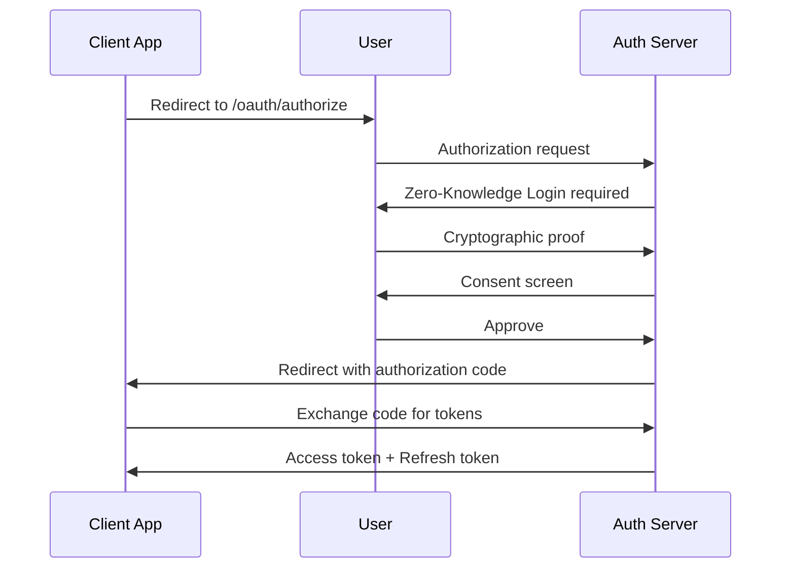
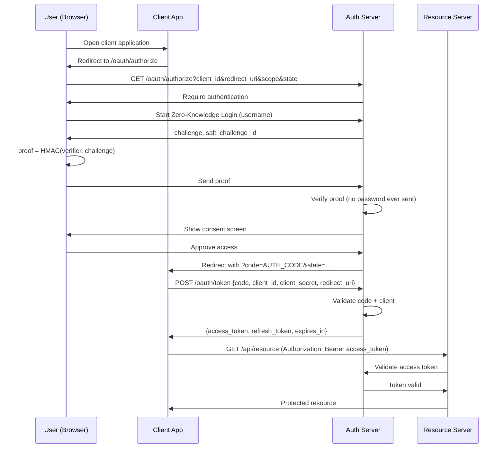

# Oauth 2.0 Authorization

## High Level design


More details explanation visually.


## 1️⃣ Oauth 2.0

### Domain Layer
At `/internal/domain/aggregates/client/types.go`
```golang
package client

type GrantType string

const (
	GrantAuthorizationCode GrantType = "authorization_code"
	GrantRefreshToken      GrantType = "refresh_token"
	GrantClientCredentials GrantType = "client_credentials"
)
```

At `/internal/domain/aggregates/client/client.go` 
```golang
package client

type Client struct {
	ID           string
	SecretHash   string
	RedirectURIs []string
	Scopes       []string
	GrantTypes   []GrantType
	IsPublic     bool
}

func (c *Client) AllowsRedirect(uri string) bool {
	return slices.Contains(c.RedirectURIs, uri)
}

func (c *Client) AllowsScope(scope string) bool {
	return slices.Contains(c.Scopes, scope)
}
```

Add client repository interface at `/internal/domain/aggregates/client/client_repository.go`
```golang
package client

import "context"

type Repository interface {
	FindByID(ctx context.Context, id string) (*Client, error)
}
```

At `/internal/domain/aggregates/oauth/authorization_code.go`
```golang
package oauth

import "time"

type AuthorizationCode struct {
	Code        string
	ClientID    string
	UserID      string
	RedirectURI string
	Scopes      []string
	ExpiresAt   time.Time
}

func (a *AuthorizationCode) IsExpired(now time.Time) bool {
	return now.After(a.ExpiresAt)
}
```

At `/internal/domain/aggregates/oauth/authorization_code_repository.go`
```golang
package oauth

import "context"

type Repository interface {
	Save(ctx context.Context, code *AuthorizationCode) error
	Get(ctx context.Context, code string) (*AuthorizationCode, error)
}
```

At `/internal/domain/aggregates/token/token.go`
```golang
package token

import "time"

type Token struct {
	AccessToken  string
	RefreshToken string
	IDToken      string

	ClientID string
	UserID   string
	Scopes   []string

	ExpiresAt time.Time
}

func (t *Token) IsExpired(now time.Time) bool {
	return now.After(t.ExpiresAt)
}
```

At `/internal/domain/aggregates/token/token_repository.go`
```golang
package token

import "context"

type Repository interface {
	Save(ctx context.Context, token *Token) error
	FindByAccessToken(ctx context.Context, token string) (*Token, error)
	Revoke(ctx context.Context, token string) error
}
```

### Application Layer
At `/internal/application/dtos/authorization_request.go`
```golang
package dtos

type AuthorizeRequest struct {
	ResponseType string
	ClientID     string
	RedirectURI  string
	Scope        string
	State        string
	UserID       string // already authenticated user
}
```

At `/internal/application/dtos/authorization_response.go`
```golang
package dtos

type AuthorizeResponse struct {
	RedirectURI string
	Code        string
	State       string
}
```

At `/internal/application/dtos/token_request.go`
```golang
package dtos

type TokenRequest struct {
	GrantType    string
	Code         string
	RedirectURI  string
	ClientID     string
	ClientSecret string
}
```

At `/internal/application/dtos/token_response.go`
```golang
package dtos

type TokenResponse struct {
	AccessToken  string
	RefreshToken string
	TokenType    string
	ExpiresIn    int64
	Scope        string
	IDToken      string // OIDC (added later)
}
```

At `/internal/application/errors.go`
```golang
package application

import "errors"

var (
	ErrUnsupportedResponseType = errors.New("unsupported response type")
	ErrInvalidClient           = errors.New("invalid client")
	ErrInvalidRedirectURI      = errors.New("invalid redirect uri")
	ErrInvalidScope            = errors.New("invalid scope")
)
```

Then at `/internal/application/oauth/oauth_service.go`
```golang
package oauth

import (
	"context"
	"crypto/rand"
	"encoding/base64"
	"strings"
	"time"

	"github.com/rabbicse/auth-service/internal/application"
	"github.com/rabbicse/auth-service/internal/application/dtos"
	"github.com/rabbicse/auth-service/internal/domain/aggregates/client"
	oauthDomain "github.com/rabbicse/auth-service/internal/domain/aggregates/oauth"
)

type OAuthService struct {
	clientRepo   client.ClientRepository
	authCodeRepo oauthDomain.AuthorizationCodeRepository
	clock        func() time.Time
}

func NewOAuthService(
	clientRepo client.ClientRepository,
	authCodeRepo oauthDomain.AuthorizationCodeRepository,
	clock func() time.Time,
) *OAuthService {
	return &OAuthService{
		clientRepo:   clientRepo,
		authCodeRepo: authCodeRepo,
		clock:        clock,
	}
}

func (s *OAuthService) Authorize(
	ctx context.Context,
	req dtos.AuthorizationRequest,
) (*dtos.AuthorizationResponse, error) {

	// 1. response_type validation
	if req.ResponseType != "code" {
		return nil, application.ErrUnsupportedResponseType
	}

	// 2. Load client
	c, err := s.clientRepo.FindByID(ctx, req.ClientID)
	if err != nil {
		return nil, application.ErrInvalidClient
	}

	// 3. Redirect URI validation
	if !c.AllowsRedirect(req.RedirectURI) {
		return nil, application.ErrInvalidRedirectURI
	}

	// 4. Scope validation
	scopes := strings.Fields(req.Scope)
	for _, scope := range scopes {
		if !c.AllowsScope(scope) {
			return nil, application.ErrInvalidScope
		}
	}

	// 5. Generate authorization code
	code, err := generateSecureCode(32)
	if err != nil {
		return nil, err
	}

	authCode := &oauthDomain.AuthorizationCode{
		Code:        code,
		ClientID:    c.ID,
		UserID:      req.UserID,
		RedirectURI: req.RedirectURI,
		Scopes:      scopes,
		ExpiresAt:   s.clock().Add(5 * time.Minute),
	}

	// 6. Persist authorization code
	if err := s.authCodeRepo.Save(ctx, authCode); err != nil {
		return nil, err
	}

	// 7. Build response
	return &dtos.AuthorizationResponse{
		RedirectURI: req.RedirectURI,
		Code:        code,
		State:       req.State,
	}, nil
}

func generateSecureCode(length int) (string, error) {
	b := make([]byte, length)
	if _, err := rand.Read(b); err != nil {
		return "", err
	}
	return base64.RawURLEncoding.EncodeToString(b), nil
}
```

Then at `/internal/application/oauth/token_service.go`
```golang
package oauth

import (
	"context"
	"crypto/rand"
	"encoding/base64"
	"strings"
	"time"

	"github.com/rabbicse/auth-service/internal/application"
	"github.com/rabbicse/auth-service/internal/application/dtos"
	"github.com/rabbicse/auth-service/internal/domain/aggregates/client"
	oauthDomain "github.com/rabbicse/auth-service/internal/domain/aggregates/oauth"
	tokenDomain "github.com/rabbicse/auth-service/internal/domain/aggregates/token"
	"github.com/rabbicse/auth-service/internal/domain/aggregates/user"
)

type TokenService struct {
	clientRepo   client.ClientRepository
	userRepo     user.UserRepository
	authCodeRepo oauthDomain.AuthorizationCodeRepository
	tokenRepo    tokenDomain.TokenRepository
	clock        func() time.Time
}

func NewTokenService(
	clientRepo client.ClientRepository,
	userRepo user.UserRepository,
	authCodeRepo oauthDomain.AuthorizationCodeRepository,
	tokenRepo tokenDomain.TokenRepository,
	clock func() time.Time,
) *TokenService {
	return &TokenService{
		clientRepo:   clientRepo,
		userRepo:     userRepo,
		authCodeRepo: authCodeRepo,
		tokenRepo:    tokenRepo,
		clock:        clock,
	}
}

func (s *TokenService) Token(
	ctx context.Context,
	req dtos.TokenRequest,
) (*dtos.TokenResponse, error) {

	if req.GrantType != "authorization_code" {
		return nil, application.ErrUnsupportedGrantType
	}

	// 1. Load client
	c, err := s.clientRepo.FindByID(ctx, req.ClientID)
	if err != nil {
		return nil, application.ErrInvalidClient
	}

	// 2. Authenticate client (confidential clients)
	if !c.IsPublic {
		if !verifySecret(req.ClientSecret, c.SecretHash) {
			return nil, application.ErrClientAuthFailed
		}
	}

	// 3. Get authorization code (one-time)
	authCode, err := s.authCodeRepo.Get(ctx, req.Code)
	if err != nil {
		return nil, application.ErrInvalidAuthCode
	}

	// 4. Validate auth code
	if authCode.ClientID != c.ID {
		return nil, application.ErrInvalidAuthCode
	}

	if authCode.RedirectURI != req.RedirectURI {
		return nil, application.ErrInvalidRedirectURI
	}

	if authCode.IsExpired(s.clock()) {
		return nil, application.ErrInvalidAuthCode
	}

	// 5. Issue tokens
	accessToken, _ := generateSecureToken(32)
	refreshToken, _ := generateSecureToken(32)

	expiresAt := s.clock().Add(1 * time.Hour)

	tok := &tokenDomain.Token{
		AccessToken:  accessToken,
		RefreshToken: refreshToken,
		ClientID:     c.ID,
		UserID:       authCode.UserID,
		Scopes:       authCode.Scopes,
		ExpiresAt:    expiresAt,
	}

	if err := s.tokenRepo.Save(ctx, tok); err != nil {
		return nil, err
	}

	return &dtos.TokenResponse{
		AccessToken:  accessToken,
		RefreshToken: refreshToken,
		TokenType:    "Bearer",
		ExpiresIn:    int64(time.Until(expiresAt).Seconds()),
		Scope:        strings.Join(authCode.Scopes, " "),
	}, nil
}

func generateSecureToken(length int) (string, error) {
	b := make([]byte, length)
	if _, err := rand.Read(b); err != nil {
		return "", err
	}
	return base64.RawURLEncoding.EncodeToString(b), nil
}

func verifySecret(raw, hash string) bool {
	return raw == hash // TEMP – replace with bcrypt
}
```

### Infrastructure Layer
At `/internal/infrastructure/persistence/memory/client_repository.go`
```golang
package memory

import (
	"context"
	"sync"

	"github.com/rabbicse/auth-service/internal/domain"
	"github.com/rabbicse/auth-service/internal/domain/aggregates/client"
)

type ClientRepository struct {
	mu      sync.RWMutex
	clients map[string]*client.Client
}

func NewClientRepository(seed []*client.Client) *ClientRepository {
	m := make(map[string]*client.Client)
	for _, c := range seed {
		m[c.ID] = c
	}
	return &ClientRepository{clients: m}
}

func (r *ClientRepository) FindByID(ctx context.Context, id string) (*client.Client, error) {
	r.mu.RLock()
	defer r.mu.RUnlock()

	c, ok := r.clients[id]
	if !ok {
		return nil, domain.ErrNotFound
	}
	return c, nil
}
```

At `/internal/infrastructure/persistence/memory/authorization_code_repository.go`
```golang
package memory

import (
	"context"
	"sync"

	"github.com/rabbicse/auth-service/internal/domain"
	"github.com/rabbicse/auth-service/internal/domain/aggregates/oauth"
)

type AuthCodeRepository struct {
	mu    sync.Mutex
	codes map[string]*oauth.AuthorizationCode
}

func NewAuthCodeRepository() *AuthCodeRepository {
	return &AuthCodeRepository{
		codes: make(map[string]*oauth.AuthorizationCode),
	}
}

func (r *AuthCodeRepository) Save(ctx context.Context, code *oauth.AuthorizationCode) error {
	r.mu.Lock()
	defer r.mu.Unlock()

	r.codes[code.Code] = code
	return nil
}

func (r *AuthCodeRepository) Get(ctx context.Context, code string) (*oauth.AuthorizationCode, error) {
	r.mu.Lock()
	defer r.mu.Unlock()

	ac, ok := r.codes[code]
	if !ok {
		return nil, domain.ErrNotFound
	}

	delete(r.codes, code) // 🔐 replay protection
	return ac, nil
}
```

At `/internal/infrastructure/persistence/memory/token_repository.go`
```golang
package memory

import (
	"context"
	"sync"

	"github.com/rabbicse/auth-service/internal/domain"
	"github.com/rabbicse/auth-service/internal/domain/aggregates/token"
)

type TokenRepository struct {
	mu     sync.RWMutex
	tokens map[string]*token.Token
}

func NewTokenRepository() *TokenRepository {
	return &TokenRepository{
		tokens: make(map[string]*token.Token),
	}
}

func (r *TokenRepository) Save(ctx context.Context, t *token.Token) error {
	r.mu.Lock()
	defer r.mu.Unlock()

	r.tokens[t.AccessToken] = t
	return nil
}

func (r *TokenRepository) FindByAccessToken(ctx context.Context, accessToken string) (*token.Token, error) {
	r.mu.RLock()
	defer r.mu.RUnlock()

	t, ok := r.tokens[accessToken]
	if !ok {
		return nil, domain.ErrNotFound
	}
	return t, nil
}

func (r *TokenRepository) Revoke(ctx context.Context, accessToken string) error {
	r.mu.Lock()
	defer r.mu.Unlock()

	delete(r.tokens, accessToken)
	return nil
}
```

### Interface Layer
At `/internal/interfaces/http/handlers/oauth_handler.go`
```golang
package handlers

import (
	"net/http"

	"github.com/gin-gonic/gin"
	applicationDtos "github.com/rabbicse/auth-service/internal/application/dtos"
	"github.com/rabbicse/auth-service/internal/application/oauth"
)

type AuthorizeHandler struct {
	oauth oauth.OAuthService
}

func NewAuthorizeHandler(oauth oauth.OAuthService) *AuthorizeHandler {
	return &AuthorizeHandler{oauth: oauth}
}

func (h *AuthorizeHandler) Handle(c *gin.Context) {
	req := applicationDtos.AuthorizationRequest{
		ResponseType: c.Query("response_type"),
		ClientID:     c.Query("client_id"),
		RedirectURI:  c.Query("redirect_uri"),
		Scope:        c.Query("scope"),
		State:        c.Query("state"),

		// ⚠️ TEMP: assume user already authenticated
		UserID: "user-123",
	}

	resp, err := h.oauth.Authorize(c.Request.Context(), req)
	if err != nil {
		c.JSON(http.StatusBadRequest, gin.H{
			"error": err.Error(),
		})
		return
	}

	redirect := resp.RedirectURI +
		"?code=" + resp.Code +
		"&state=" + resp.State

	c.Redirect(http.StatusFound, redirect)
}
```

At `/internal/interfaces/http/handlers/token_handler.go`
```golang
package handlers

import (
	"net/http"

	"github.com/gin-gonic/gin"
	"github.com/rabbicse/auth-service/internal/application/dtos"
	"github.com/rabbicse/auth-service/internal/application/oauth"
)

type TokenHandler struct {
	oauth oauth.TokenService
}

func NewTokenHandler(oauth oauth.TokenService) *TokenHandler {
	return &TokenHandler{oauth: oauth}
}

func (h *TokenHandler) Handle(c *gin.Context) {
	req := dtos.TokenRequest{
		GrantType:    c.PostForm("grant_type"),
		Code:         c.PostForm("code"),
		RedirectURI:  c.PostForm("redirect_uri"),
		ClientID:     c.PostForm("client_id"),
		ClientSecret: c.PostForm("client_secret"),
	}

	resp, err := h.oauth.Token(c.Request.Context(), req)
	if err != nil {
		c.JSON(http.StatusBadRequest, gin.H{
			"error": err.Error(),
		})
		return
	}

	c.JSON(http.StatusOK, resp)
}
```

At `/internal/interfaces/http/router.go` add the following lines.
```golang
	// Oauth 2.0 routes
	r.GET("/authorize", oauthHandler.Handle)
	r.POST("/token", tokenHandler.Handle)
```

So full file will be.
```golang
package http

import (
	"github.com/gin-gonic/gin"
	"github.com/rabbicse/auth-service/internal/interfaces/http/handlers"
)

func NewRouter(
	registerHandler *handlers.RegisterHandler,
	loginHandler *handlers.LoginHandler,
	oauthHandler *handlers.AuthorizeHandler,
	tokenHandler *handlers.TokenHandler,
) *gin.Engine {
	r := gin.New()

	r.Use(gin.Logger())
	r.Use(gin.Recovery())

	r.GET("/health", func(c *gin.Context) {
		c.JSON(200, gin.H{
			"status": "ok",
		})
	})

	// User registration route
	r.POST("/users/register", registerHandler.Register)

	// Login routes
	r.POST("/login/challenge", loginHandler.Start)
	r.POST("/login/verify", loginHandler.Verify)

	// Oauth 2.0 routes
	r.GET("/authorize", oauthHandler.Handle)
	r.POST("/token", tokenHandler.Handle)

	return r
}
```

Add or edit the following code block at `main.go`
```golang
	// Initialize Oauth 2.0 services and handlers
	clientRepo := memory.NewClientRepository([]*client.Client{
		{
			ID:           "client-123",
			SecretHash:   "secret", // replace with bcrypt later
			RedirectURIs: []string{"http://localhost:3000/callback"},
			Scopes:       []string{"openid", "profile", "email"},
			GrantTypes:   []client.GrantType{client.GrantAuthorizationCode},
			IsPublic:     false,
		},
	})
	authCodeRepo := memory.NewAuthCodeRepository()
	// tokenRepo := memory.NewTokenRepository()
	oauthService := oauth.NewOAuthService(clientRepo, authCodeRepo, time.Now)
	// tokenService := oauth.NewTokenService(tokenRepo, time.Now)
	oAutheHandler := handlers.NewAuthorizeHandler(oauthService)
	// tokenHandler := handlers.NewTokenHandler(tokenService)

	// 2. Create HTTP router
	router := httpiface.NewRouter(registerHandler, loginHandler, oAutheHandler)
```


Almost done! It's time to test application! Before test application just add `Introspection` endpoint temporarily. Later we'll implement `JWT`, `OIDC` and `PKCE`. 

Add `/internal/application/dtos/introspection_response.go`

```golang
type IntrospectionResponse struct {
	Active   bool   `json:"active"`
	Sub      string `json:"sub,omitempty"`
	ClientID string `json:"client_id,omitempty"`
	Scope    string `json:"scope,omitempty"`
	Exp      int64  `json:"exp,omitempty"`
}
```

Add `/internal/application/oauth/introspection_service.go`
 
```golang
package oauth

import (
	"time"

	"github.com/rabbicse/auth-service/internal/domain/aggregates/token"
)

type IntrospectionService struct {
	tokenRepo token.TokenRepository
	clock     func() time.Time
}

func NewIntrospectionService(
	tokenRepo token.TokenRepository,
	clock func() time.Time,
) *IntrospectionService {
	return &IntrospectionService{
		tokenRepo: tokenRepo,
		clock:     clock,
	}
}

func (s *IntrospectionService) Introspect(accessToken string) (*token.Token, bool) {
	t, err := s.tokenRepo.FindByAccessToken(accessToken)
	if err != nil {
		return nil, false
	}

	if t.IsExpired(s.clock()) {
		return nil, false
	}

	return t, true
}
```

At `/internal/interfaces/http/handlers/introspect_handler.go`
```golang
package handlers

import (
	"net/http"
	"strings"

	"github.com/gin-gonic/gin"
	"github.com/rabbicse/auth-service/internal/application/dtos"
	"github.com/rabbicse/auth-service/internal/application/oauth"
)

type IntrospectionHandler struct {
	svc *oauth.IntrospectionService
}

func NewIntrospectionHandler(svc *oauth.IntrospectionService) *IntrospectionHandler {
	return &IntrospectionHandler{svc}
}

func (h *IntrospectionHandler) Introspect(c *gin.Context) {

	// ---- Client authentication (Resource Server) ----
	clientID, clientSecret, ok := c.Request.BasicAuth()
	if !ok || !isValidResourceServer(clientID, clientSecret) {
		c.JSON(http.StatusUnauthorized, gin.H{"error": "invalid client"})
		return
	}

	// ---- Parse token ----
	var req struct {
		Token string `json:"token" form:"token"`
	}

	if err := c.ShouldBind(&req); err != nil || req.Token == "" {
		c.JSON(http.StatusOK, dtos.IntrospectionResponse{Active: false})
		return
	}

	t, active := h.svc.Introspect(req.Token)
	if !active {
		c.JSON(http.StatusOK, dtos.IntrospectionResponse{Active: false})
		return
	}

	c.JSON(http.StatusOK, dtos.IntrospectionResponse{
		Active:   true,
		Sub:      t.UserID,
		ClientID: t.ClientID,
		Scope:    strings.Join(t.Scopes, " "),
		Exp:      t.ExpiresAt.Unix(),
	})
}

func isValidResourceServer(id, secret string) bool {
	return id == "resource-server" && secret == "secret"
}
```

At `/internal/interfaces/http/router.go` update
```golang
	r.POST("/oauth/introspect", introspectionHandler.Introspect)
```

## Resource service
Let's create resource service. Create new directory and project for resource service. This time I'm gonna write only the important part instead of full instruction. 
writee the following command to create new directory and write the following command.
```bash
mkdir resource-service
cd resource-service
go mod init github.com/rabbicse/resource-service
```

At `/internal/application/dtos/introspection_response.go`
```golang
package dtos

type IntrospectionResponse struct {
	Active    bool   `json:"active"`
	Sub       string `json:"sub"`
	Scope     string `json:"scope"`
	ClientID  string `json:"client_id"`
	ExpiresAt int64  `json:"exp"`
}
```

Then at `/internal/application/token/token_validator.go`
```golang
package token

import (
	"bytes"
	"encoding/json"
	"net/http"

	"github.com/rabbicse/resource-service/internal/application/dtos"
)

type TokenValidator struct {
	IntrospectionURL string
	ClientID         string
	ClientSecret     string
}

func (v *TokenValidator) Validate(token string) (*dtos.IntrospectionResponse, error) {
	body := map[string]string{
		"token": token,
	}

	b, _ := json.Marshal(body)

	req, err := http.NewRequest(
		"POST",
		v.IntrospectionURL,
		bytes.NewBuffer(b),
	)
	if err != nil {
		return nil, err
	}

	req.SetBasicAuth(v.ClientID, v.ClientSecret)
	req.Header.Set("Content-Type", "application/json")

	resp, err := http.DefaultClient.Do(req)
	if err != nil {
		return nil, err
	}
	defer resp.Body.Close()

	var res dtos.IntrospectionResponse
	if err := json.NewDecoder(resp.Body).Decode(&res); err != nil {
		return nil, err
	}

	if !res.Active {
		return nil, http.ErrNoCookie
	}

	return &res, nil
}
```

At `/internal/application/handlers/resource.go`
```golang
package handlers

import "github.com/gin-gonic/gin"

func ProtectedResource(c *gin.Context) {
	sub, _ := c.Get("sub")
	scope, _ := c.Get("scope")

	c.JSON(200, gin.H{
		"message": "protected resource accessed",
		"user":    sub,
		"scope":   scope,
	})
}
```

Add authorization middleware at `/internal/middleware/authorization.go`
```golang
package middleware

import (
	"strings"

	"github.com/gin-gonic/gin"
	"github.com/rabbicse/resource-service/internal/application/token"
)

func AuthorizationMiddleware(validator *token.TokenValidator) gin.HandlerFunc {
	return func(c *gin.Context) {
		auth := c.GetHeader("Authorization")
		if !strings.HasPrefix(auth, "Bearer ") {
			c.AbortWithStatusJSON(401, gin.H{"error": "missing token"})
			return
		}

		token := strings.TrimPrefix(auth, "Bearer ")

		introspection, err := validator.Validate(token)
		if err != nil {
			c.AbortWithStatusJSON(401, gin.H{"error": "invalid token"})
			return
		}

		// Attach user info to context
		c.Set("sub", introspection.Sub)
		c.Set("scope", introspection.Scope)

		c.Next()
	}
}
```

Finally at `/cmd/server/main.go`
```golang
package main

import (
	"github.com/gin-gonic/gin"
	"github.com/rabbicse/resource-service/internal/application/token"
	"github.com/rabbicse/resource-service/internal/handlers"
	"github.com/rabbicse/resource-service/internal/middleware"
)

func main() {
	r := gin.Default()

	validator := &token.TokenValidator{
		IntrospectionURL: "http://localhost:8080/oauth/introspect",
		ClientID:         "resource-server",
		ClientSecret:     "secret",
	}

	r.GET(
		"/protected",
		middleware.AuthorizationMiddleware(validator),
		handlers.ProtectedResource,
	)

	r.Run(":9090")
}
```

Run application by the following command.
```bash
go run ./cmd/server
```

## Test the authorization flow
At `/internal/tests/oauth_flow_test.go`
```golang
package tests

import (
	"bytes"
	"encoding/json"
	"io"
	"net/http"
	"net/url"
	"testing"
)

const (
	OauthBaseURL    = "http://localhost:8080"
	ResourceBaseURL = "http://localhost:9090"
	ClientID        = "client-123"
	ClientSecret    = "secret"
	RedirectURI     = "http://localhost:3000/callback"
	Scope           = "profile email"
	State           = "xyz123"
)

func Test_OAuth2_Authorization_Code_Flow(t *testing.T) {

	// --------------------------------
	// 1. Start Authorization Request
	// --------------------------------
	t.Log("1. Starting OAuth Authorization")

	authURL := OauthBaseURL + "/authorize?" +
		"response_type=code" +
		"&client_id=" + url.QueryEscape(ClientID) +
		"&redirect_uri=" + url.QueryEscape(RedirectURI) +
		"&scope=" + url.QueryEscape(Scope) +
		"&state=" + State
	t.Logf("Authorization URL: %v", authURL)

	// We don't follow redirects because we want to capture the code
	client := &http.Client{
		CheckRedirect: func(req *http.Request, via []*http.Request) error {
			return http.ErrUseLastResponse
		},
	}

	resp, err := client.Get(authURL)
	if err != nil {
		t.Fatal(err)
	}
	defer resp.Body.Close()

	if resp.StatusCode != http.StatusFound {
		b, _ := io.ReadAll(resp.Body)
		t.Fatalf("Expected redirect, got %d: %s", resp.StatusCode, string(b))
	}

	location := resp.Header.Get("Location")
	if location == "" {
		t.Fatal("No redirect location returned")
	}

	redirectURL, err := url.Parse(location)
	if err != nil {
		t.Fatal(err)
	}

	code := redirectURL.Query().Get("code")
	if code == "" {
		t.Fatal("Authorization code not found in redirect")
	}

	t.Log("✔ Authorization code:", code)

	// --------------------------------
	// 2. Exchange Code for Token
	// --------------------------------
	t.Log("2. Exchanging authorization code for token")

	form := url.Values{}
	form.Set("grant_type", "authorization_code")
	form.Set("code", code)
	form.Set("redirect_uri", RedirectURI)
	form.Set("client_id", ClientID)
	form.Set("client_secret", ClientSecret)

	req, err := http.NewRequest("POST", OauthBaseURL+"/token", bytes.NewBufferString(form.Encode()))
	if err != nil {
		t.Fatal(err)
	}
	req.Header.Set("Content-Type", "application/x-www-form-urlencoded")

	resp, err = http.DefaultClient.Do(req)
	if err != nil {
		t.Fatal(err)
	}
	defer resp.Body.Close()

	if resp.StatusCode != 200 {
		b, _ := io.ReadAll(resp.Body)
		t.Fatalf("Token exchange failed: %d %s", resp.StatusCode, string(b))
	}

	var tokenResp map[string]any
	json.NewDecoder(resp.Body).Decode(&tokenResp)
	t.Logf("Token response: %v", tokenResp)

	accessToken, ok := tokenResp["access_token"].(string)
	if !ok || accessToken == "" {
		t.Fatal("Access token not returned")
	}

	t.Log("✔ Access token issued")

	// --------------------------------
	// 3. Use Access Token
	// --------------------------------
	t.Log("3. Accessing protected resource")

	req, err = http.NewRequest("GET", ResourceBaseURL+"/protected", nil)
	if err != nil {
		t.Fatal(err)
	}
	req.Header.Set("Authorization", "Bearer "+accessToken)

	resp, err = http.DefaultClient.Do(req)
	if err != nil {
		t.Fatal(err)
	}
	defer resp.Body.Close()

	if resp.StatusCode != 200 {
		b, _ := io.ReadAll(resp.Body)
		t.Fatalf("Protected resource access failed: %d %s", resp.StatusCode, string(b))
	}

	t.Log("✔ Protected resource accessed")

	// --------------------------------
	// 4. Replay Attack Test (MUST FAIL)
	// --------------------------------
	t.Log("4. Testing replay attack (must fail)")

	req, err = http.NewRequest("POST", OauthBaseURL+"/token", bytes.NewBufferString(form.Encode()))
	if err != nil {
		t.Fatal(err)
	}
	req.Header.Set("Content-Type", "application/x-www-form-urlencoded")

	resp, err = http.DefaultClient.Do(req)
	if err != nil {
		t.Fatal(err)
	}
	defer resp.Body.Close()

	if resp.StatusCode == 200 {
		t.Fatal("Replay attack succeeded, this is a security bug")
	}

	t.Log("✔ Replay attack correctly blocked")
}
```

### Run Test
Write the following test with the following command.
```bash
go test ./tests/oauth_flow_test.go -v
```

If all test passes then oauth 2.0 flow is gonna be perfect. Happy coding :)

What just happend?
- Created basic oauth 2.0 flow, grant type-authorization_code, by interacting with resource server and assuming usger is authenticated.

Next steps:
- Need to integrate with real time application authentication flow
- Instead of simple token we need to integrate JWT (Json Web Token)
- OIDC integration
- PKCE flow with oauth 2.0
- MFA - Optional step for more secure authentication

