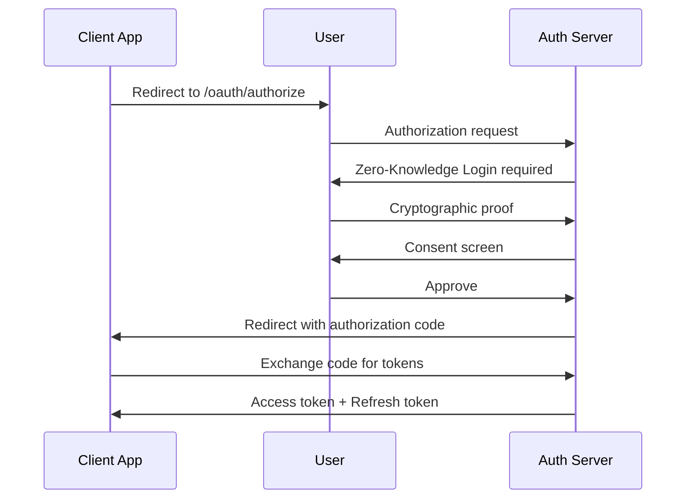
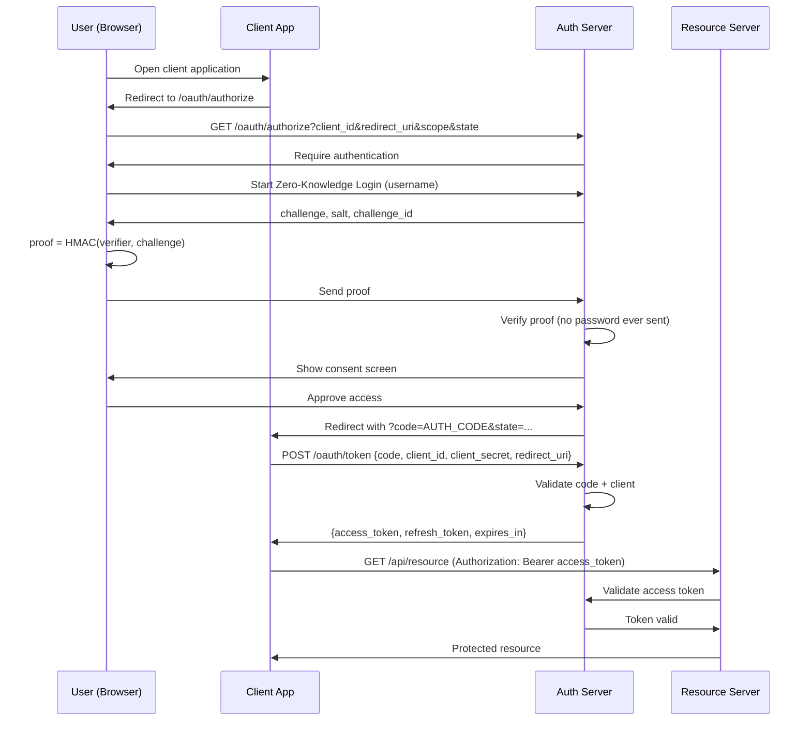

# Oauth 2.0 Authorization

## High Level design


More details explanation visually.


## 1️⃣ Oauth 2.0

### Domain Layer
At `/internal/domain/aggregates/client/client.go` 
```golang
package client

import "slices"

type GrantType string

const (
	GrantAuthorizationCode GrantType = "authorization_code"
	GrantRefreshToken      GrantType = "refresh_token"
	GrantClientCredentials GrantType = "client_credentials"
)

type Client struct {
	ID           string
	SecretHash   string
	RedirectURIs []string
	Scopes       []string
	GrantTypes   []GrantType
	IsPublic     bool
}

func (c *Client) AllowsRedirect(uri string) bool {
	return slices.Contains(c.RedirectURIs, uri)
}

func (c *Client) AllowsScope(scope string) bool {
	return slices.Contains(c.Scopes, scope)
}
```

Add client repository interface at `/internal/domain/aggregates/client/client_repository.go`
```golang
package client

import "context"

type Repository interface {
	FindByID(ctx context.Context, id string) (*Client, error)
}
```

At `/internal/domain/aggregates/oauth/authorization_code.go`
```golang
package oauth

import "time"

type AuthorizationCode struct {
	Code        string
	ClientID    string
	UserID      string
	RedirectURI string
	Scopes      []string
	ExpiresAt   time.Time
}

func (a *AuthorizationCode) IsExpired(now time.Time) bool {
	return now.After(a.ExpiresAt)
}
```

At `/internal/domain/aggregates/oauth/authorization_code_repository.go`
```golang
package oauth

import "context"

type Repository interface {
	Save(ctx context.Context, code *AuthorizationCode) error
	Get(ctx context.Context, code string) (*AuthorizationCode, error)
}
```

At `/internal/domain/aggregates/token/token.go`
```golang
package token

import "time"

type Token struct {
	AccessToken  string
	RefreshToken string
	IDToken      string

	ClientID string
	UserID   string
	Scopes   []string

	ExpiresAt time.Time
}

func (t *Token) IsExpired(now time.Time) bool {
	return now.After(t.ExpiresAt)
}
```

At `/internal/domain/aggregates/token/token_repository.go`
```golang
package token

import "context"

type Repository interface {
	Save(ctx context.Context, token *Token) error
	FindByAccessToken(ctx context.Context, token string) (*Token, error)
	Revoke(ctx context.Context, token string) error
}
```

### Application Layer
At `/internal/application/dtos/authorization_request.go`
```golang
package dtos

type AuthorizeRequest struct {
	ResponseType string
	ClientID     string
	RedirectURI  string
	Scope        string
	State        string
	UserID       string // already authenticated user
}
```

At `/internal/application/dtos/authorization_response.go`
```golang
package dtos

type AuthorizeResponse struct {
	RedirectURI string
	Code        string
	State       string
}
```

At `/internal/application/dtos/token_request.go`
```golang
package dtos

type TokenRequest struct {
	GrantType    string
	Code         string
	RedirectURI  string
	ClientID     string
	ClientSecret string
}
```

At `/internal/application/dtos/token_response.go`
```golang
package dtos

type TokenResponse struct {
	AccessToken  string
	RefreshToken string
	TokenType    string
	ExpiresIn    int64
	Scope        string
	IDToken      string // OIDC (added later)
}
```

At `/internal/application/errors.go`
```golang
package application

import "errors"

var (
	ErrUnsupportedResponseType = errors.New("unsupported response type")
	ErrInvalidClient           = errors.New("invalid client")
	ErrInvalidRedirectURI      = errors.New("invalid redirect uri")
	ErrInvalidScope            = errors.New("invalid scope")
)
```

Then at `/internal/application/oauth/oauth_service.go`
```golang
package oauth

import (
	"context"
	"crypto/rand"
	"encoding/base64"
	"strings"
	"time"

	"github.com/rabbicse/auth-service/internal/application"
	"github.com/rabbicse/auth-service/internal/application/dtos"
	"github.com/rabbicse/auth-service/internal/domain/aggregates/client"
	oauthDomain "github.com/rabbicse/auth-service/internal/domain/aggregates/oauth"
)

type OAuthService struct {
	clientRepo   client.ClientRepository
	authCodeRepo oauthDomain.AuthorizationCodeRepository
	clock        func() time.Time
}

func NewOAuthService(
	clientRepo client.ClientRepository,
	authCodeRepo oauthDomain.AuthorizationCodeRepository,
	clock func() time.Time,
) *OAuthService {
	return &OAuthService{
		clientRepo:   clientRepo,
		authCodeRepo: authCodeRepo,
		clock:        clock,
	}
}

func (s *OAuthService) Authorize(
	ctx context.Context,
	req dtos.AuthorizationRequest,
) (*dtos.AuthorizationResponse, error) {

	// 1. response_type validation
	if req.ResponseType != "code" {
		return nil, application.ErrUnsupportedResponseType
	}

	// 2. Load client
	c, err := s.clientRepo.FindByID(ctx, req.ClientID)
	if err != nil {
		return nil, application.ErrInvalidClient
	}

	// 3. Redirect URI validation
	if !c.AllowsRedirect(req.RedirectURI) {
		return nil, application.ErrInvalidRedirectURI
	}

	// 4. Scope validation
	scopes := strings.Fields(req.Scope)
	for _, scope := range scopes {
		if !c.AllowsScope(scope) {
			return nil, application.ErrInvalidScope
		}
	}

	// 5. Generate authorization code
	code, err := generateSecureCode(32)
	if err != nil {
		return nil, err
	}

	authCode := &oauthDomain.AuthorizationCode{
		Code:        code,
		ClientID:    c.ID,
		UserID:      req.UserID,
		RedirectURI: req.RedirectURI,
		Scopes:      scopes,
		ExpiresAt:   s.clock().Add(5 * time.Minute),
	}

	// 6. Persist authorization code
	if err := s.authCodeRepo.Save(ctx, authCode); err != nil {
		return nil, err
	}

	// 7. Build response
	return &dtos.AuthorizationResponse{
		RedirectURI: req.RedirectURI,
		Code:        code,
		State:       req.State,
	}, nil
}

func generateSecureCode(length int) (string, error) {
	b := make([]byte, length)
	if _, err := rand.Read(b); err != nil {
		return "", err
	}
	return base64.RawURLEncoding.EncodeToString(b), nil
}
```

Then at `/internal/application/oauth/token_service.go`
```golang
package oauth

import (
	"context"
	"crypto/rand"
	"encoding/base64"
	"strings"
	"time"

	"github.com/rabbicse/auth-service/internal/application"
	"github.com/rabbicse/auth-service/internal/application/dtos"
	"github.com/rabbicse/auth-service/internal/domain/aggregates/client"
	oauthDomain "github.com/rabbicse/auth-service/internal/domain/aggregates/oauth"
	tokenDomain "github.com/rabbicse/auth-service/internal/domain/aggregates/token"
	"github.com/rabbicse/auth-service/internal/domain/aggregates/user"
)

type TokenService struct {
	clientRepo   client.ClientRepository
	userRepo     user.UserRepository
	authCodeRepo oauthDomain.AuthorizationCodeRepository
	tokenRepo    tokenDomain.TokenRepository
	clock        func() time.Time
}

func NewTokenService(
	clientRepo client.ClientRepository,
	userRepo user.UserRepository,
	authCodeRepo oauthDomain.AuthorizationCodeRepository,
	tokenRepo tokenDomain.TokenRepository,
	clock func() time.Time,
) *TokenService {
	return &TokenService{
		clientRepo:   clientRepo,
		userRepo:     userRepo,
		authCodeRepo: authCodeRepo,
		tokenRepo:    tokenRepo,
		clock:        clock,
	}
}

func (s *TokenService) Token(
	ctx context.Context,
	req dtos.TokenRequest,
) (*dtos.TokenResponse, error) {

	if req.GrantType != "authorization_code" {
		return nil, application.ErrUnsupportedGrantType
	}

	// 1. Load client
	c, err := s.clientRepo.FindByID(ctx, req.ClientID)
	if err != nil {
		return nil, application.ErrInvalidClient
	}

	// 2. Authenticate client (confidential clients)
	if !c.IsPublic {
		if !verifySecret(req.ClientSecret, c.SecretHash) {
			return nil, application.ErrClientAuthFailed
		}
	}

	// 3. Get authorization code (one-time)
	authCode, err := s.authCodeRepo.Get(ctx, req.Code)
	if err != nil {
		return nil, application.ErrInvalidAuthCode
	}

	// 4. Validate auth code
	if authCode.ClientID != c.ID {
		return nil, application.ErrInvalidAuthCode
	}

	if authCode.RedirectURI != req.RedirectURI {
		return nil, application.ErrInvalidRedirectURI
	}

	if authCode.IsExpired(s.clock()) {
		return nil, application.ErrInvalidAuthCode
	}

	// 5. Issue tokens
	accessToken, _ := generateSecureToken(32)
	refreshToken, _ := generateSecureToken(32)

	expiresAt := s.clock().Add(1 * time.Hour)

	tok := &tokenDomain.Token{
		AccessToken:  accessToken,
		RefreshToken: refreshToken,
		ClientID:     c.ID,
		UserID:       authCode.UserID,
		Scopes:       authCode.Scopes,
		ExpiresAt:    expiresAt,
	}

	if err := s.tokenRepo.Save(ctx, tok); err != nil {
		return nil, err
	}

	return &dtos.TokenResponse{
		AccessToken:  accessToken,
		RefreshToken: refreshToken,
		TokenType:    "Bearer",
		ExpiresIn:    int64(time.Until(expiresAt).Seconds()),
		Scope:        strings.Join(authCode.Scopes, " "),
	}, nil
}

func generateSecureToken(length int) (string, error) {
	b := make([]byte, length)
	if _, err := rand.Read(b); err != nil {
		return "", err
	}
	return base64.RawURLEncoding.EncodeToString(b), nil
}

func verifySecret(raw, hash string) bool {
	return raw == hash // TEMP – replace with bcrypt
}
```

### Infrastructure Layer
At `/internal/infrastructure/persistence/memory/client_repository.go`
```golang
package memory

import (
	"context"
	"sync"

	"github.com/rabbicse/auth-service/internal/domain"
	"github.com/rabbicse/auth-service/internal/domain/aggregates/client"
)

type ClientRepository struct {
	mu      sync.RWMutex
	clients map[string]*client.Client
}

func NewClientRepository(seed []*client.Client) *ClientRepository {
	m := make(map[string]*client.Client)
	for _, c := range seed {
		m[c.ID] = c
	}
	return &ClientRepository{clients: m}
}

func (r *ClientRepository) FindByID(ctx context.Context, id string) (*client.Client, error) {
	r.mu.RLock()
	defer r.mu.RUnlock()

	c, ok := r.clients[id]
	if !ok {
		return nil, domain.ErrNotFound
	}
	return c, nil
}
```

At `/internal/infrastructure/persistence/memory/authorization_code_repository.go`
```golang
package memory

import (
	"context"
	"sync"

	"github.com/rabbicse/auth-service/internal/domain"
	"github.com/rabbicse/auth-service/internal/domain/aggregates/oauth"
)

type AuthCodeRepository struct {
	mu    sync.Mutex
	codes map[string]*oauth.AuthorizationCode
}

func NewAuthCodeRepository() *AuthCodeRepository {
	return &AuthCodeRepository{
		codes: make(map[string]*oauth.AuthorizationCode),
	}
}

func (r *AuthCodeRepository) Save(ctx context.Context, code *oauth.AuthorizationCode) error {
	r.mu.Lock()
	defer r.mu.Unlock()

	r.codes[code.Code] = code
	return nil
}

func (r *AuthCodeRepository) Get(ctx context.Context, code string) (*oauth.AuthorizationCode, error) {
	r.mu.Lock()
	defer r.mu.Unlock()

	ac, ok := r.codes[code]
	if !ok {
		return nil, domain.ErrNotFound
	}

	delete(r.codes, code) // 🔐 replay protection
	return ac, nil
}
```

At `/internal/infrastructure/persistence/memory/token_repository.go`
```golang
package memory

import (
	"context"
	"sync"

	"github.com/rabbicse/auth-service/internal/domain"
	"github.com/rabbicse/auth-service/internal/domain/aggregates/token"
)

type TokenRepository struct {
	mu     sync.RWMutex
	tokens map[string]*token.Token
}

func NewTokenRepository() *TokenRepository {
	return &TokenRepository{
		tokens: make(map[string]*token.Token),
	}
}

func (r *TokenRepository) Save(ctx context.Context, t *token.Token) error {
	r.mu.Lock()
	defer r.mu.Unlock()

	r.tokens[t.AccessToken] = t
	return nil
}

func (r *TokenRepository) FindByAccessToken(ctx context.Context, accessToken string) (*token.Token, error) {
	r.mu.RLock()
	defer r.mu.RUnlock()

	t, ok := r.tokens[accessToken]
	if !ok {
		return nil, domain.ErrNotFound
	}
	return t, nil
}

func (r *TokenRepository) Revoke(ctx context.Context, accessToken string) error {
	r.mu.Lock()
	defer r.mu.Unlock()

	delete(r.tokens, accessToken)
	return nil
}
```

### Interface Layer
At `/internal/interfaces/http/handlers/oauth_handler.go`
```golang
package handlers

import (
	"net/http"

	"github.com/gin-gonic/gin"
	applicationDtos "github.com/rabbicse/auth-service/internal/application/dtos"
	"github.com/rabbicse/auth-service/internal/application/oauth"
)

type AuthorizeHandler struct {
	oauth oauth.OAuthService
}

func NewAuthorizeHandler(oauth oauth.OAuthService) *AuthorizeHandler {
	return &AuthorizeHandler{oauth: oauth}
}

func (h *AuthorizeHandler) Handle(c *gin.Context) {
	req := applicationDtos.AuthorizationRequest{
		ResponseType: c.Query("response_type"),
		ClientID:     c.Query("client_id"),
		RedirectURI:  c.Query("redirect_uri"),
		Scope:        c.Query("scope"),
		State:        c.Query("state"),

		// ⚠️ TEMP: assume user already authenticated
		UserID: "user-123",
	}

	resp, err := h.oauth.Authorize(c.Request.Context(), req)
	if err != nil {
		c.JSON(http.StatusBadRequest, gin.H{
			"error": err.Error(),
		})
		return
	}

	redirect := resp.RedirectURI +
		"?code=" + resp.Code +
		"&state=" + resp.State

	c.Redirect(http.StatusFound, redirect)
}
```

At `/internal/interfaces/http/handlers/token_handler.go`
```golang
package handlers

import (
	"net/http"

	"github.com/gin-gonic/gin"
	"github.com/rabbicse/auth-service/internal/application/dtos"
	"github.com/rabbicse/auth-service/internal/application/oauth"
)

type TokenHandler struct {
	oauth oauth.TokenService
}

func NewTokenHandler(oauth oauth.TokenService) *TokenHandler {
	return &TokenHandler{oauth: oauth}
}

func (h *TokenHandler) Handle(c *gin.Context) {
	req := dtos.TokenRequest{
		GrantType:    c.PostForm("grant_type"),
		Code:         c.PostForm("code"),
		RedirectURI:  c.PostForm("redirect_uri"),
		ClientID:     c.PostForm("client_id"),
		ClientSecret: c.PostForm("client_secret"),
	}

	resp, err := h.oauth.Token(c.Request.Context(), req)
	if err != nil {
		c.JSON(http.StatusBadRequest, gin.H{
			"error": err.Error(),
		})
		return
	}

	c.JSON(http.StatusOK, resp)
}
```

At `/internal/interfaces/http/router.go` add the following lines.
```golang
	// Oauth 2.0 routes
	r.GET("/authorize", oauthHandler.Handle)
	r.POST("/token", tokenHandler.Handle)
```

So full file will be.
```golang
package http

import (
	"github.com/gin-gonic/gin"
	"github.com/rabbicse/auth-service/internal/interfaces/http/handlers"
)

func NewRouter(
	registerHandler *handlers.RegisterHandler,
	loginHandler *handlers.LoginHandler,
	oauthHandler *handlers.AuthorizeHandler,
	tokenHandler *handlers.TokenHandler,
) *gin.Engine {
	r := gin.New()

	r.Use(gin.Logger())
	r.Use(gin.Recovery())

	r.GET("/health", func(c *gin.Context) {
		c.JSON(200, gin.H{
			"status": "ok",
		})
	})

	// User registration route
	r.POST("/users/register", registerHandler.Register)

	// Login routes
	r.POST("/login/challenge", loginHandler.Start)
	r.POST("/login/verify", loginHandler.Verify)

	// Oauth 2.0 routes
	r.GET("/authorize", oauthHandler.Handle)
	r.POST("/token", tokenHandler.Handle)

	return r
}
```

Add or edit the following code block at `main.go`
```golang
	// Initialize Oauth 2.0 services and handlers
	clientRepo := memory.NewClientRepository([]*client.Client{
		{
			ID:           "client-123",
			SecretHash:   "secret", // replace with bcrypt later
			RedirectURIs: []string{"http://localhost:3000/callback"},
			Scopes:       []string{"openid", "profile", "email"},
			GrantTypes:   []client.GrantType{client.GrantAuthorizationCode},
			IsPublic:     false,
		},
	})
	authCodeRepo := memory.NewAuthCodeRepository()
	// tokenRepo := memory.NewTokenRepository()
	oauthService := oauth.NewOAuthService(clientRepo, authCodeRepo, time.Now)
	// tokenService := oauth.NewTokenService(tokenRepo, time.Now)
	oAutheHandler := handlers.NewAuthorizeHandler(oauthService)
	// tokenHandler := handlers.NewTokenHandler(tokenService)

	// 2. Create HTTP router
	router := httpiface.NewRouter(registerHandler, loginHandler, oAutheHandler)
```


