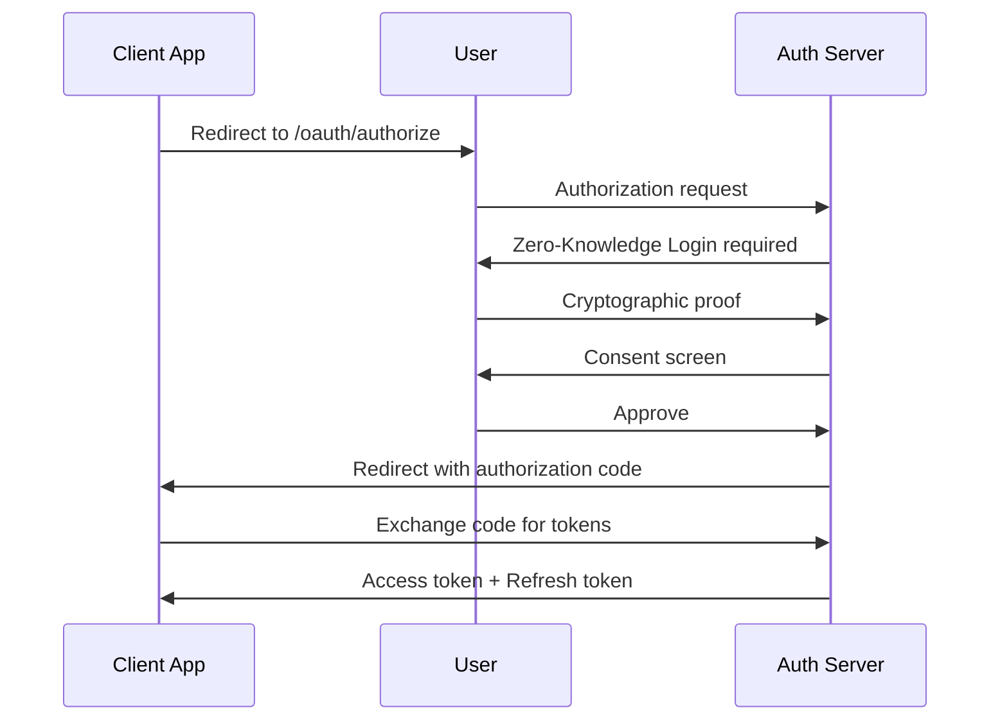
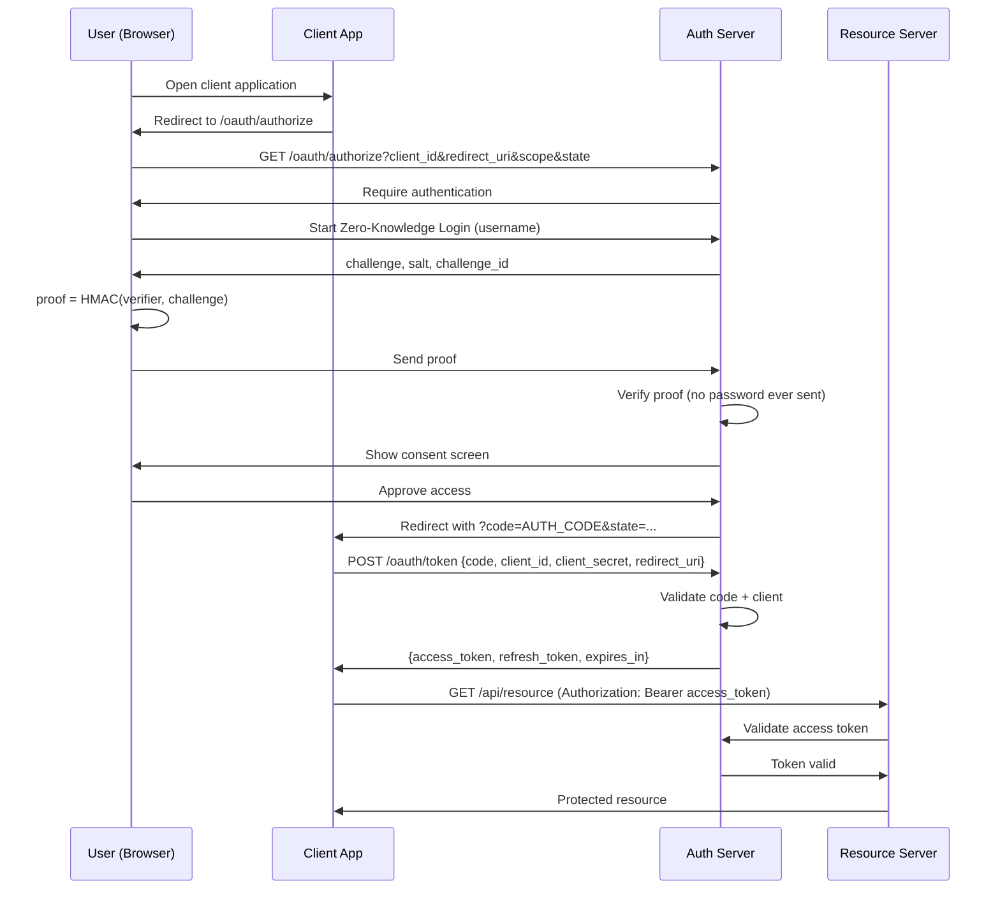

# Oauth 2.0 Authorization

## High Level design


More details explanation visually.


## 1️⃣ Oauth 2.0

### Domain Layer
At `/internal/domain/aggregates/client/client.go` 
```golang
package client

import "slices"

type GrantType string

const (
	GrantAuthorizationCode GrantType = "authorization_code"
	GrantRefreshToken      GrantType = "refresh_token"
	GrantClientCredentials GrantType = "client_credentials"
)

type Client struct {
	ID           string
	SecretHash   string
	RedirectURIs []string
	Scopes       []string
	GrantTypes   []GrantType
	IsPublic     bool
}

func (c *Client) AllowsRedirect(uri string) bool {
	return slices.Contains(c.RedirectURIs, uri)
}

func (c *Client) AllowsScope(scope string) bool {
	return slices.Contains(c.Scopes, scope)
}
```

Add client repository interface at `/internal/domain/aggregates/client/client_repository.go`
```golang
package client

import "context"

type Repository interface {
	FindByID(ctx context.Context, id string) (*Client, error)
}
```

At `/internal/domain/aggregates/oauth/authorization_code.go`
```golang
package oauth

import "time"

type AuthorizationCode struct {
	Code        string
	ClientID    string
	UserID      string
	RedirectURI string
	Scopes      []string
	ExpiresAt   time.Time
}

func (a *AuthorizationCode) IsExpired(now time.Time) bool {
	return now.After(a.ExpiresAt)
}
```

At `/internal/domain/aggregates/oauth/authorization_code_repository.go`
```golang
package oauth

import "context"

type Repository interface {
	Save(ctx context.Context, code *AuthorizationCode) error
	Get(ctx context.Context, code string) (*AuthorizationCode, error)
}
```

### Application Layer
At `/internal/application/dtos/authorization_request.go`
```golang
package dtos

type AuthorizeRequest struct {
	ResponseType string
	ClientID     string
	RedirectURI  string
	Scope        string
	State        string
	UserID       string // already authenticated user
}
```

At `/internal/application/dtos/authorization_response.go`
```golang
package dtos

type AuthorizeResponse struct {
	RedirectURI string
	Code        string
	State       string
}
```

At `/internal/application/dtos/token_request.go`
```golang
package dtos

type TokenRequest struct {
	GrantType    string
	Code         string
	RedirectURI  string
	ClientID     string
	ClientSecret string
}
```

At `/internal/application/dtos/token_response.go`
```golang
package dtos

type TokenResponse struct {
	AccessToken  string
	RefreshToken string
	TokenType    string
	ExpiresIn    int64
	Scope        string
	IDToken      string // OIDC (added later)
}
```

At `/internal/application/errors.go`
```golang
package application

import "errors"

var (
	ErrUnsupportedResponseType = errors.New("unsupported response type")
	ErrInvalidClient           = errors.New("invalid client")
	ErrInvalidRedirectURI      = errors.New("invalid redirect uri")
	ErrInvalidScope            = errors.New("invalid scope")
)
```

Then at `/internal/application/oauth/oauth_service.go`
```golang
package oauth

import (
	"context"
	"crypto/rand"
	"encoding/base64"
	"strings"
	"time"

	"github.com/rabbicse/auth-service/internal/application"
	"github.com/rabbicse/auth-service/internal/application/dtos"
	"github.com/rabbicse/auth-service/internal/domain/aggregates/client"
	oauthDomain "github.com/rabbicse/auth-service/internal/domain/aggregates/oauth"
)

type OAuthService struct {
	clientRepo   client.ClientRepository
	authCodeRepo oauthDomain.AuthorizationCodeRepository
	clock        func() time.Time
}

func NewOAuthService(
	clientRepo client.ClientRepository,
	authCodeRepo oauthDomain.AuthorizationCodeRepository,
	clock func() time.Time,
) *OAuthService {
	return &OAuthService{
		clientRepo:   clientRepo,
		authCodeRepo: authCodeRepo,
		clock:        clock,
	}
}

func (s *OAuthService) Authorize(
	ctx context.Context,
	req dtos.AuthorizationRequest,
) (*dtos.AuthorizationResponse, error) {

	// 1. response_type validation
	if req.ResponseType != "code" {
		return nil, application.ErrUnsupportedResponseType
	}

	// 2. Load client
	c, err := s.clientRepo.FindByID(ctx, req.ClientID)
	if err != nil {
		return nil, application.ErrInvalidClient
	}

	// 3. Redirect URI validation
	if !c.AllowsRedirect(req.RedirectURI) {
		return nil, application.ErrInvalidRedirectURI
	}

	// 4. Scope validation
	scopes := strings.Fields(req.Scope)
	for _, scope := range scopes {
		if !c.AllowsScope(scope) {
			return nil, application.ErrInvalidScope
		}
	}

	// 5. Generate authorization code
	code, err := generateSecureCode(32)
	if err != nil {
		return nil, err
	}

	authCode := &oauthDomain.AuthorizationCode{
		Code:        code,
		ClientID:    c.ID,
		UserID:      req.UserID,
		RedirectURI: req.RedirectURI,
		Scopes:      scopes,
		ExpiresAt:   s.clock().Add(5 * time.Minute),
	}

	// 6. Persist authorization code
	if err := s.authCodeRepo.Save(ctx, authCode); err != nil {
		return nil, err
	}

	// 7. Build response
	return &dtos.AuthorizationResponse{
		RedirectURI: req.RedirectURI,
		Code:        code,
		State:       req.State,
	}, nil
}

func generateSecureCode(length int) (string, error) {
	b := make([]byte, length)
	if _, err := rand.Read(b); err != nil {
		return "", err
	}
	return base64.RawURLEncoding.EncodeToString(b), nil
}
```


