# CineBook – User Manual

> Screenshots captured automatically by Playwright against the live application.  
> All images are in `docs/screenshots/`.

---

## Table of Contents

1. [Customer Journey](#customer-journey)
   - [Browse Movies](#1-browse-movies)
   - [Movie Detail](#2-movie-detail)
   - [Seat Selection](#3-seat-selection)
   - [Selecting Seats](#4-selecting-seats)
   - [Booking History](#5-booking-history)
2. [Account](#account)
   - [Login](#6-login)
3. [Admin Panel](#admin-panel)
   - [Admin Login](#7-admin-login)
   - [Dashboard](#8-admin-dashboard)
   - [Movies – List](#9-movies-list)
   - [Movies – Create](#10-create-a-movie)
   - [Movies – Edit](#11-edit-a-movie)
   - [Theaters – List](#12-theaters-list)
   - [Theaters – Create](#13-create-a-theater)
   - [Theaters – Screens](#14-manage-screens)
   - [Screens – Add](#15-add-a-screen)
   - [Shows – List](#16-shows-list)
   - [Shows – Schedule](#17-schedule-a-show)
   - [Shows – Pick Movie](#18-pick-movie-for-show)

---

## Customer Journey

### 1. Browse Movies

The home page lists all published movies. Click any card to see showtimes and book a seat.

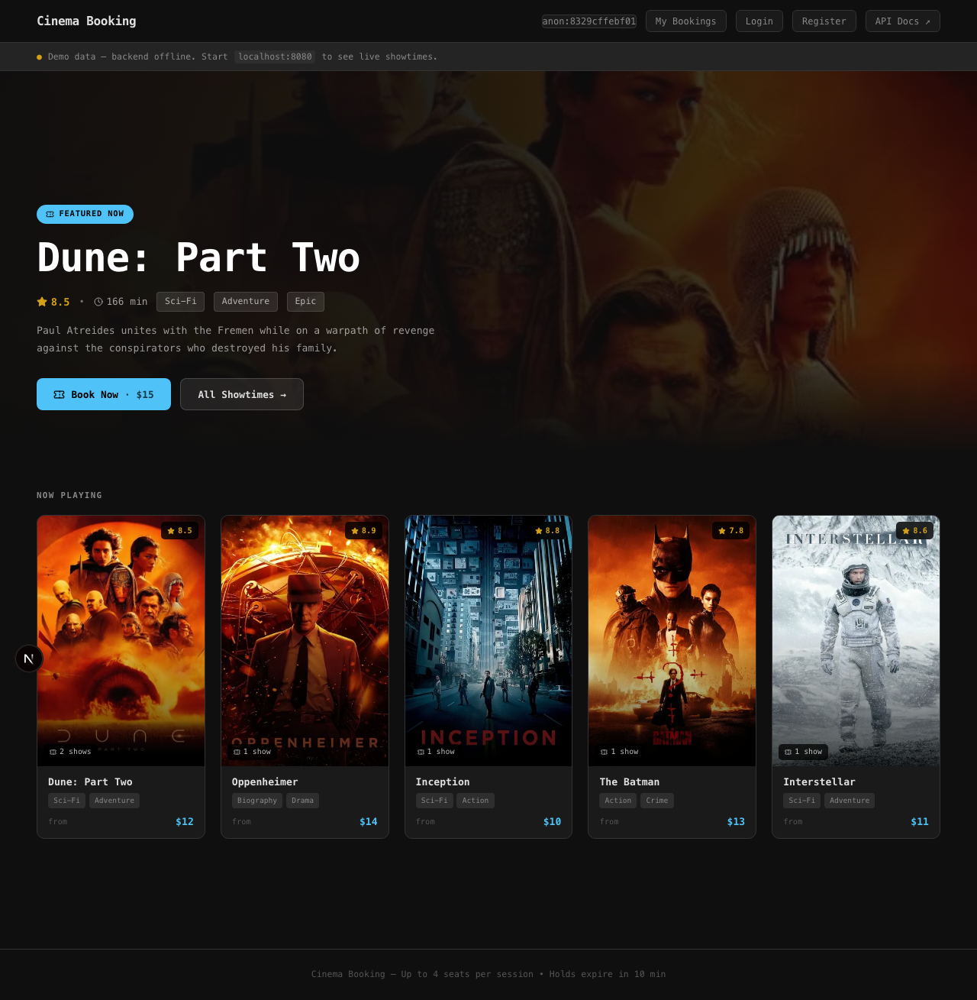

---

### 2. Movie Detail

The movie detail page shows the description, genre, rating, and all available showtimes. Click **Book Now** or a specific showtime to open the seat map.

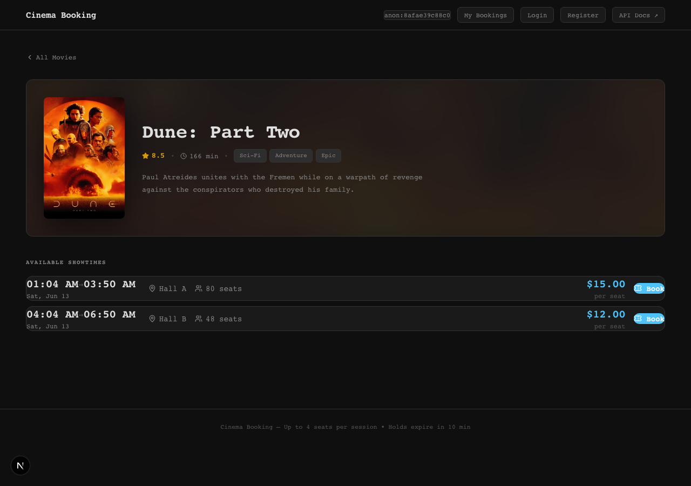

---

### 3. Seat Selection

The seat map shows every seat in the hall with real-time availability (polls every 2 seconds):

| Colour | Meaning |
|--------|---------|
| Green / Available | Free to select |
| Blue / Selected | You have chosen this seat |
| Red / Held | Another user is holding it (expires in ~10 min) |
| Grey / Taken | Already confirmed / sold |

---

### 4. Selecting Seats

Click up to 4 seats. Selected seats turn blue. The **Hold Seats** button activates once you have chosen at least one seat.

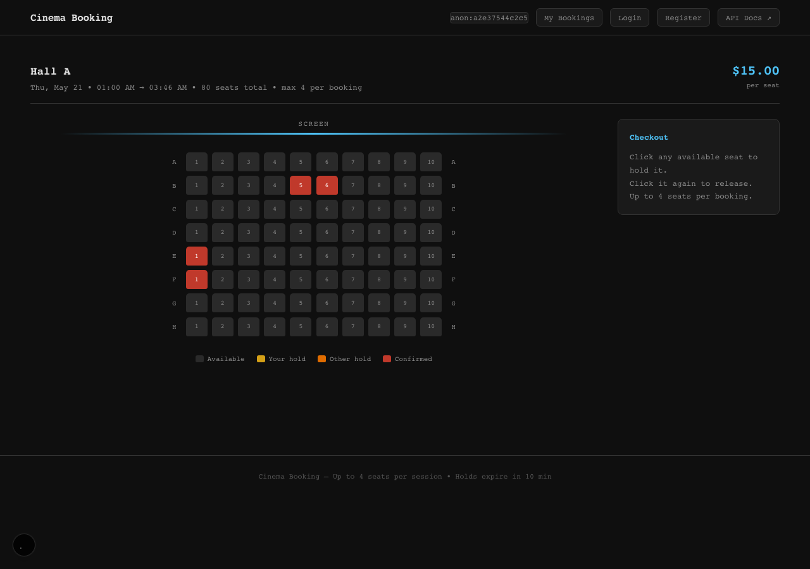

**What happens next**

1. Click **Hold Seats** — your seats are locked for 10 minutes (countdown appears).
2. Review the order summary and click **Confirm & Pay**.
3. If you change your mind, click **Release** to free the seats immediately.

---

### 5. Booking History

Every confirmed booking appears at `/bookings`. The page is tied to your browser session (no account required for customers).

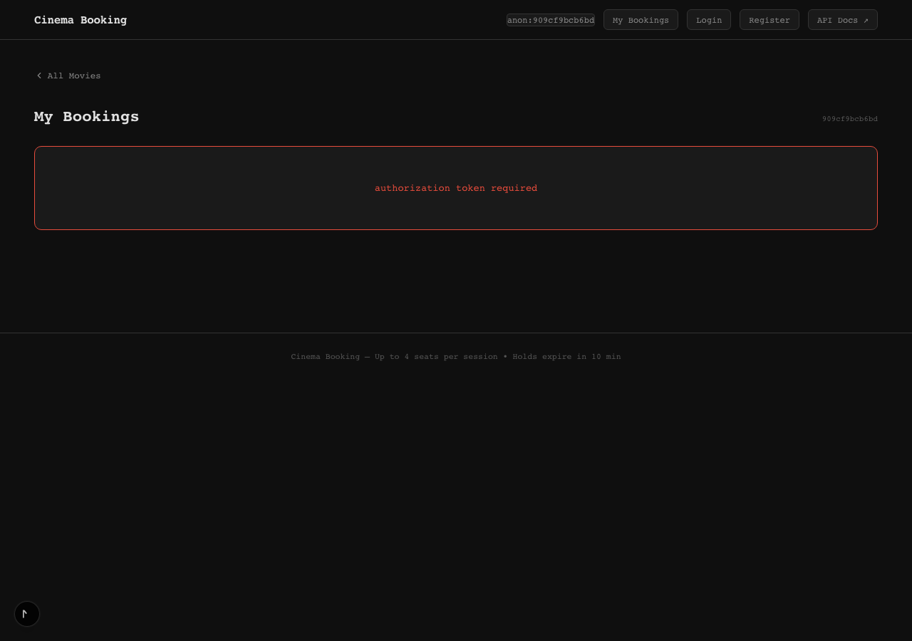

---

## Account

### 6. Login

Customers and admins both log in at `/login` using email + password.

- **Admin credentials:** `admin@cinebook.local` / `Admin1234!`
- After login, admins are redirected to the admin panel.

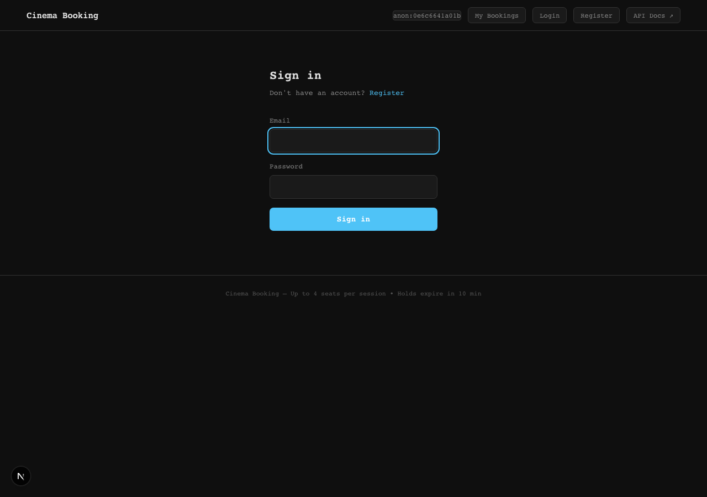

---

## Admin Panel

The admin panel is accessible at `/admin` after signing in as an admin user.

### 7. Admin Login

Fill in the admin email and password then click **Sign in**.

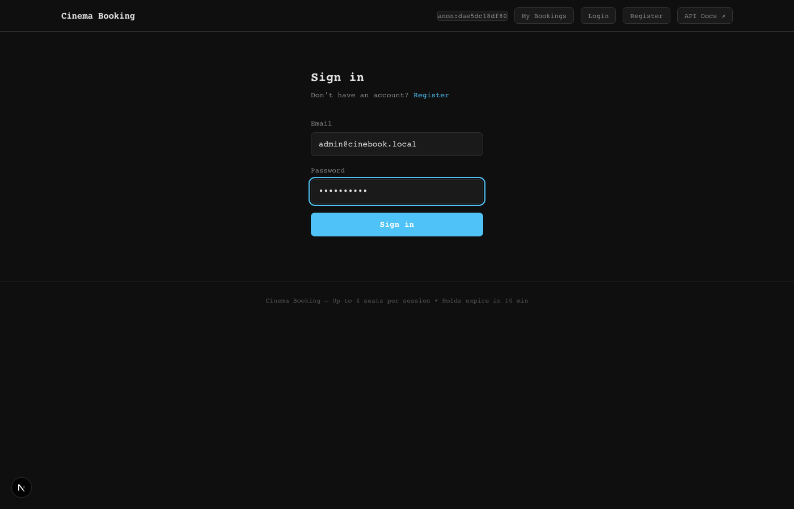

---

### 8. Admin Dashboard

The dashboard shows live counts for movies, theaters, screens, shows, and bookings. Use the left-hand navigation to manage each resource.

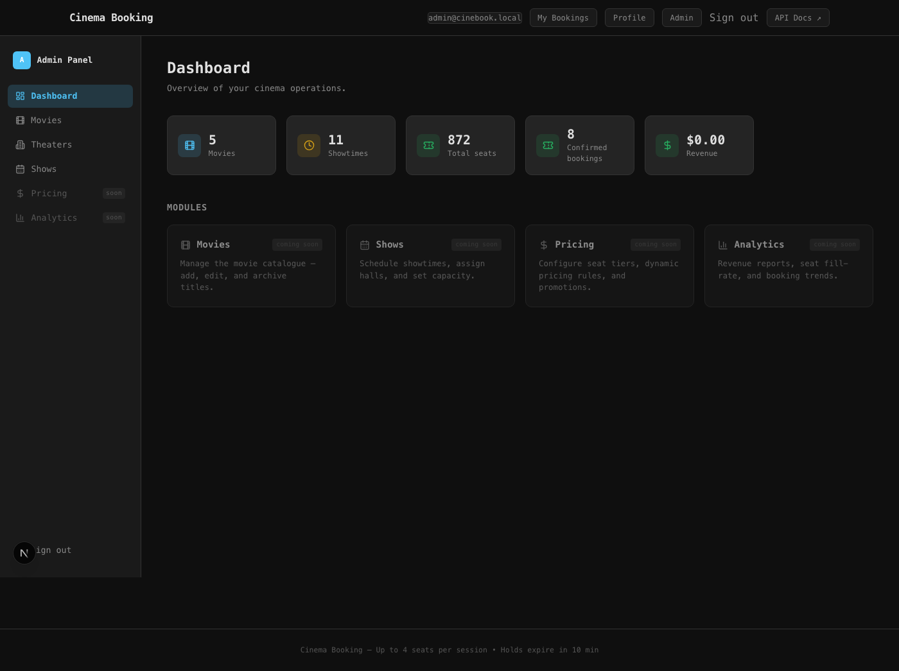

---

### 9. Movies List

`/admin/movies` lists all movies with their publish status, genre, rating, and showtime count. Use the **Publish / Unpublish** toggle to control customer visibility.

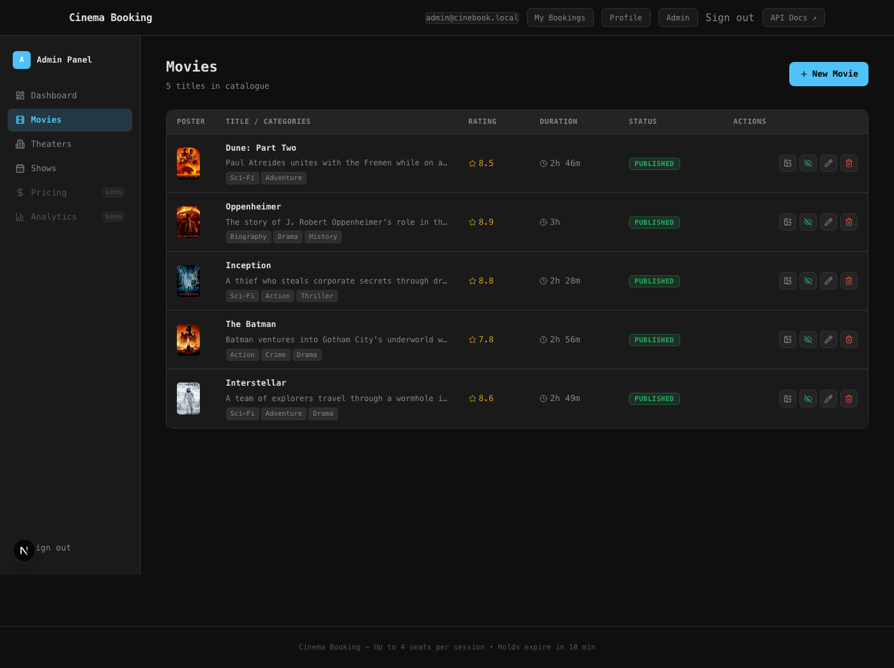

---

### 10. Create a Movie

Click **+ New Movie** to open the creation form. Required fields: title, genre, duration, rating, and poster URL.

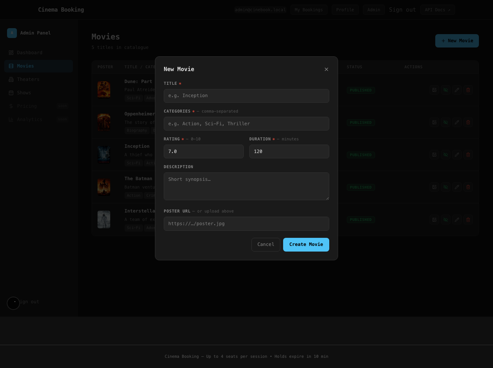

---

### 11. Edit a Movie

Click **Edit** on any row to update metadata. Changes take effect immediately on the public listing.

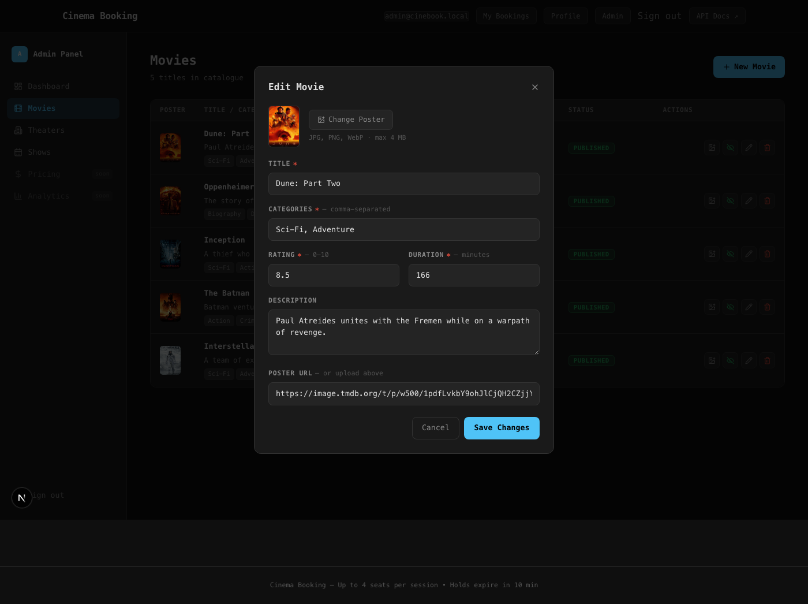

---

### 12. Theaters List

`/admin/theaters` shows every theater with its status and screen count. Expand a row to see its screens.

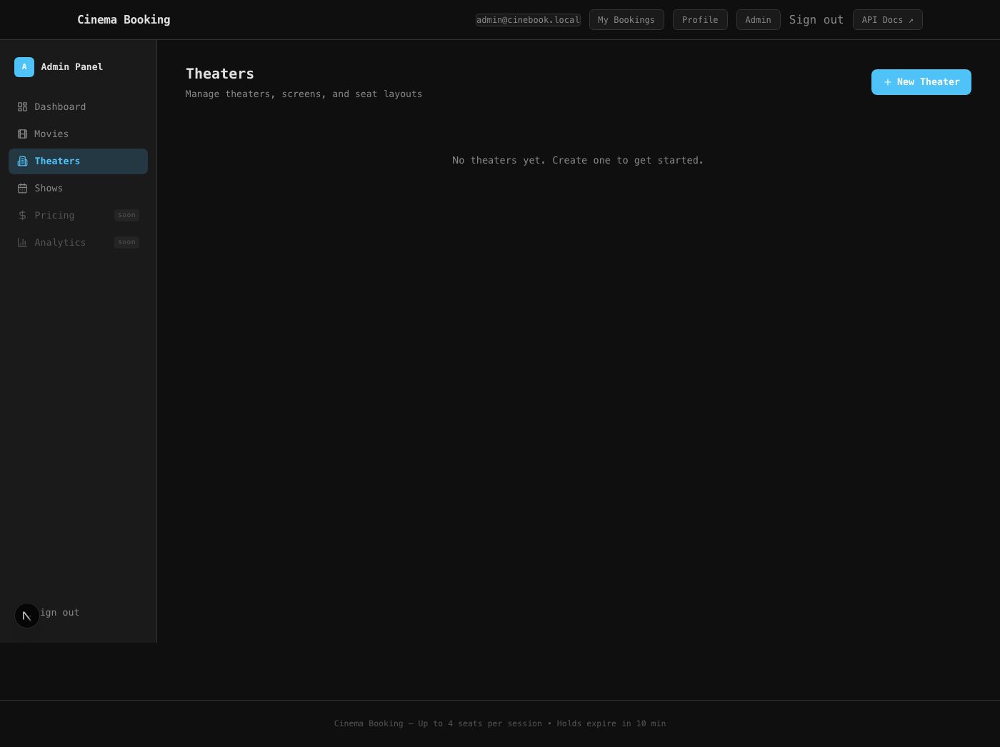

---

### 13. Create a Theater

Click **+ New Theater** and fill in the name and location. The theater starts in **active** status.

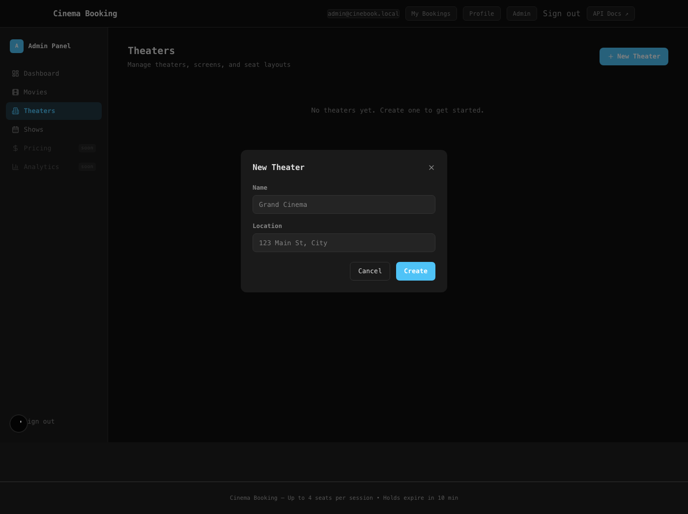

---

### 14. Manage Screens

Click the chevron on a theater row to expand its screens sub-table. Each screen shows its name, capacity, and status.

> **Disabling a theater** — if you click **Disable** on a theater, a confirmation dialog warns you that scheduling new shows on its screens will be blocked. Existing bookings are not affected.

---

### 15. Add a Screen

With the theater row expanded, click **Add Screen**. Enter a name, number of rows, and seats per row. The total capacity is calculated automatically.

---

### 16. Shows List

`/admin/shows` lists every scheduled show with its movie, screen, start time, and status. Use the status badge to filter upcoming vs. past shows.

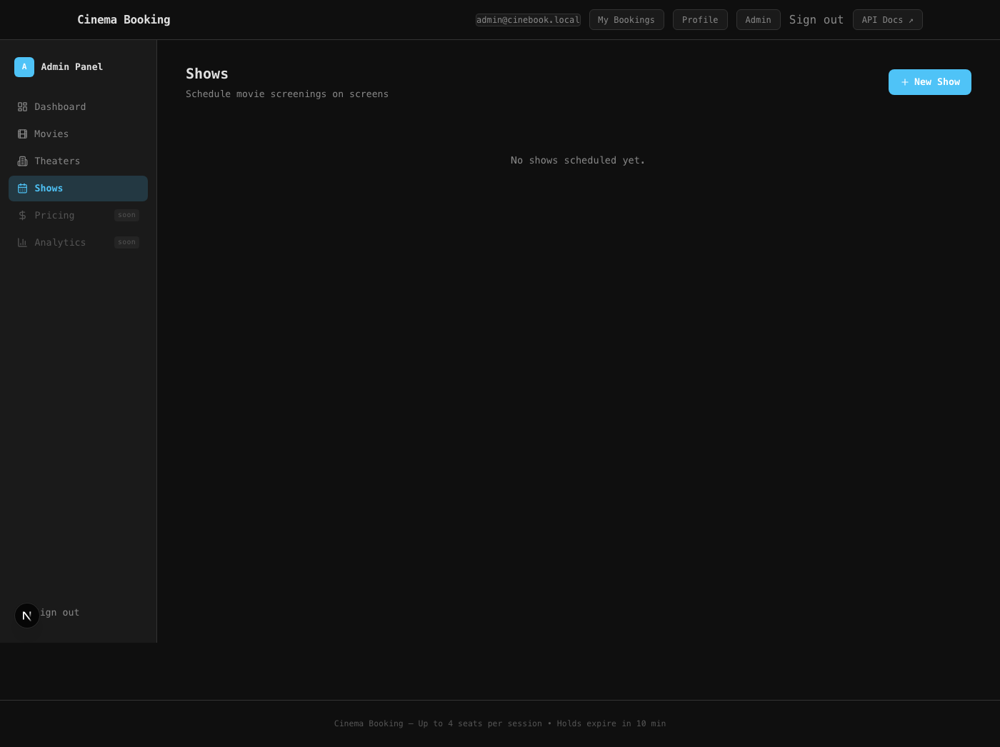

---

### 17. Schedule a Show

Click **+ New Show** to open the scheduling form. You must select a movie, a screen, and a start time.

---

### 18. Pick Movie for Show

After selecting a movie the form populates the expected end time based on the movie duration. A validation error is shown if:

- The end time is not after the start time.
- The selected screen is disabled.
- The slot overlaps with an existing show on the same screen.

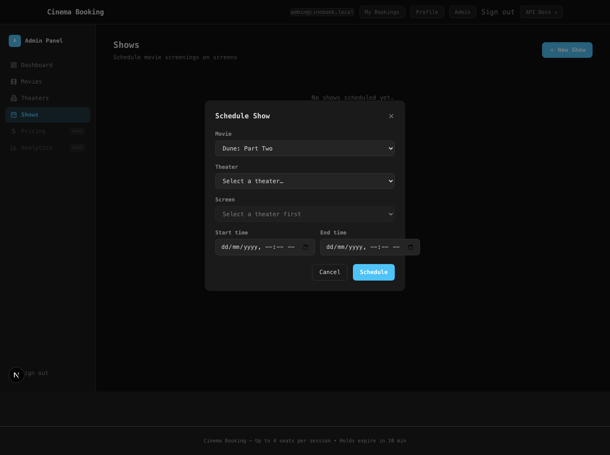

---

## Quick Reference

| What you want to do | Where to go |
|---------------------|-------------|
| Browse movies | `/` |
| Book a seat | `/movies/:id` → pick showtime → seat map |
| See your bookings | `/bookings` |
| Admin login | `/login` |
| Manage movies | `/admin/movies` |
| Manage theaters & screens | `/admin/theaters` |
| Schedule shows | `/admin/shows` |
| View stats | `/admin/dashboard` |

---

## Keyboard & Accessibility Notes

- All interactive elements are keyboard-reachable (Tab / Shift-Tab).
- Seat buttons expose an `aria-label` with row-seat notation (e.g., `A-3`).
- Colour is supplemented by shape: selected seats have a distinct border so colour-blind users can still distinguish them.

---

*Generated by Playwright 1.60.0 — screenshots reflect the live application state.*
