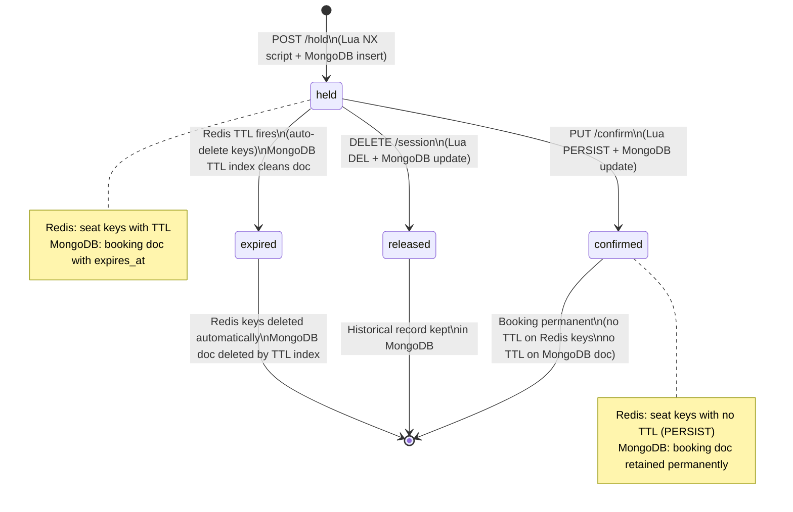
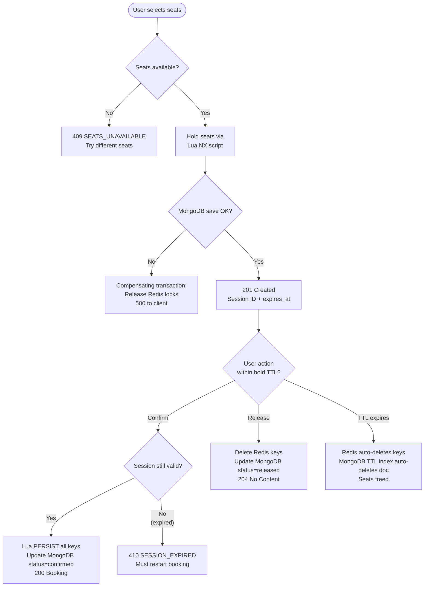

# Booking Workflow

## State Machine

```mermaid
stateDiagram-v2
    [*] --> held : POST /hold\n(Lua NX script + MongoDB insert)

    held --> confirmed : PUT /confirm\n(Lua PERSIST + MongoDB update)
    held --> released : DELETE /session\n(Lua DEL + MongoDB update)
    held --> expired : Redis TTL fires\n(auto-delete keys)\nMongoDB TTL index cleans doc

    confirmed --> [*] : Booking permanent\n(no TTL on Redis keys\nno TTL on MongoDB doc)
    released --> [*] : Historical record kept\nin MongoDB
    expired --> [*] : Redis keys deleted automatically\nMongoDB doc deleted by TTL index

    note right of held
        Redis: seat keys with TTL
        MongoDB: booking doc with expires_at
    end note

    note right of confirmed
        Redis: seat keys with no TTL (PERSIST)
        MongoDB: booking doc retained permanently
    end note
```

## Workflow Decision Tree

```mermaid
flowchart TD
    A([User selects seats]) --> B{Seats available?}
    B -- No --> C[409 SEATS_UNAVAILABLE\nTry different seats]
    B -- Yes --> D[Hold seats via\nLua NX script]
    D --> E{MongoDB save OK?}
    E -- No --> F[Compensating transaction:\nRelease Redis locks\n500 to client]
    E -- Yes --> G[201 Created\nSession ID + expires_at]
    G --> H{User action\nwithin hold TTL?}
    H -- Confirm --> I{Session still valid?}
    H -- Release --> J[Delete Redis keys\nUpdate MongoDB status=released\n204 No Content]
    H -- TTL expires --> K[Redis auto-deletes keys\nMongoDB TTL index auto-deletes doc\nSeats freed]
    I -- Yes --> L[Lua PERSIST all keys\nUpdate MongoDB status=confirmed\n200 Booking]
    I -- No\n(expired) --> M[410 SESSION_EXPIRED\nMust restart booking]
```
