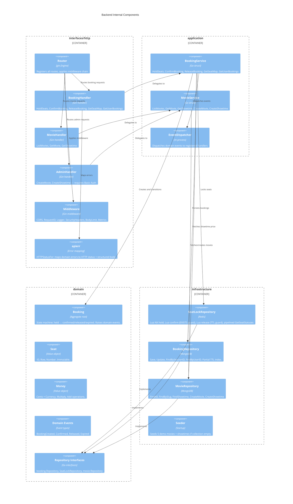

# Component Diagram (C4 Level 3 — Backend)

```mermaid
C4Component
    title Backend Internal Components

    Container_Boundary(interfaces, "interfaces/http") {
        Component(router, "Router", "gin.Engine", "Registers all routes, applies middleware chain")
        Component(bookingHandler, "BookingHandler", "Gin handler", "HoldSeats, ConfirmBooking, ReleaseBooking, GetSeatMap, GetUserBookings")
        Component(movieHandler, "MovieHandler", "Gin handler", "ListMovies, GetMovie, GetShowtime")
        Component(adminHandler, "AdminHandler", "Gin handler", "CreateMovie, CreateShowtime — requires Basic Auth")
        Component(middleware, "Middleware", "Gin middleware", "CORS, RequestID, Logger, SecurityHeaders, BodyLimit, Metrics")
        Component(apierr, "apierr", "Error mapping", "HTTPStatusFor: maps domain errors to HTTP status + structured body")
    }

    Container_Boundary(application, "application") {
        Component(bookingSvc, "BookingService", "Go struct", "HoldSeats, ConfirmBooking, ReleaseBooking, GetSeatMap, GetUserBookings")
        Component(movieSvc, "MovieService", "Go struct", "ListMovies, GetMovie, GetShowtime, CreateMovie, CreateShowtime")
        Component(dispatcher, "EventDispatcher", "In-process", "Dispatches domain events to registered handlers")
    }

    Container_Boundary(domain, "domain") {
        Component(bookingAggregate, "Booking", "Aggregate root", "State machine: held → confirmed/released/expired. Raises domain events.")
        Component(seatVO, "Seat", "Value object", "ID, Row, Number. Immutable.")
        Component(moneyVO, "Money", "Value object", "Cents + Currency. Multiply, Add operations.")
        Component(domainEvents, "Domain Events", "Event types", "BookingCreated, Confirmed, Released, Expired")
        Component(repoInterfaces, "Repository Interfaces", "Go interfaces", "booking.Repository, SeatLockRepository, movie.Repository")
    }

    Container_Boundary(infra, "infrastructure") {
        Component(seatLockRepo, "SeatLockRepository", "Redis", "Lua NX hold, Lua confirm (EXISTS guard), Lua release (TTL guard), pipelined GetSeatStatuses")
        Component(bookingRepo, "BookingRepository", "MongoDB", "Save, Update, FindBySessionID, FindByUserID. Partial TTL index.")
        Component(movieRepo, "MovieRepository", "MongoDB", "FindAll, FindBySlug, FindShowtime, CreateMovie, CreateShowtime")
        Component(seeder, "Seeder", "Startup", "Seeds 5 demo movies + showtimes if collection empty")
    }

    Rel(router, bookingHandler, "Routes booking requests")
    Rel(router, movieHandler, "Routes movie requests")
    Rel(router, adminHandler, "Routes admin requests")
    Rel(router, middleware, "Applies middleware")
    Rel(bookingHandler, bookingSvc, "Delegates to")
    Rel(movieHandler, movieSvc, "Delegates to")
    Rel(adminHandler, movieSvc, "Delegates to")
    Rel(bookingHandler, apierr, "Maps errors")
    Rel(bookingSvc, bookingAggregate, "Creates and transitions")
    Rel(bookingSvc, dispatcher, "Dispatches events")
    Rel(bookingSvc, seatLockRepo, "Locks seats")
    Rel(bookingSvc, bookingRepo, "Persists bookings")
    Rel(bookingSvc, movieRepo, "Fetches showtime price")
    Rel(movieSvc, movieRepo, "Fetches/creates movies")
    Rel(seatLockRepo, repoInterfaces, "Implements")
    Rel(bookingRepo, repoInterfaces, "Implements")
    Rel(movieRepo, repoInterfaces, "Implements")
```
