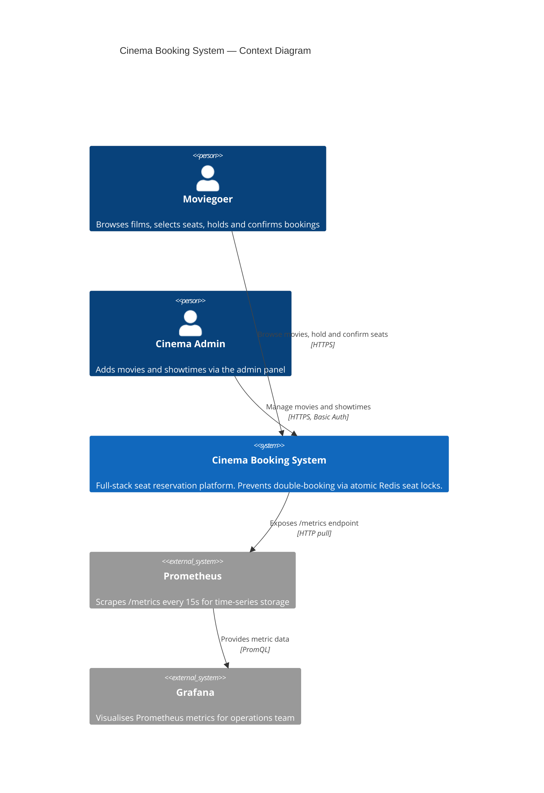

# Context Diagram (C4 Level 1)

```mermaid
C4Context
    title Cinema Booking System — Context Diagram

    Person(user, "Moviegoer", "Browses films, selects seats, holds and confirms bookings")
    Person(admin, "Cinema Admin", "Adds movies and showtimes via the admin panel")

    System(cinemaBooking, "Cinema Booking System", "Full-stack seat reservation platform. Prevents double-booking via atomic Redis seat locks.")

    System_Ext(prometheus, "Prometheus", "Scrapes /metrics every 15s for time-series storage")
    System_Ext(grafana, "Grafana", "Visualises Prometheus metrics for operations team")

    Rel(user, cinemaBooking, "Browse movies, hold and confirm seats", "HTTPS")
    Rel(admin, cinemaBooking, "Manage movies and showtimes", "HTTPS, Basic Auth")
    Rel(cinemaBooking, prometheus, "Exposes /metrics endpoint", "HTTP pull")
    Rel(prometheus, grafana, "Provides metric data", "PromQL")
```
