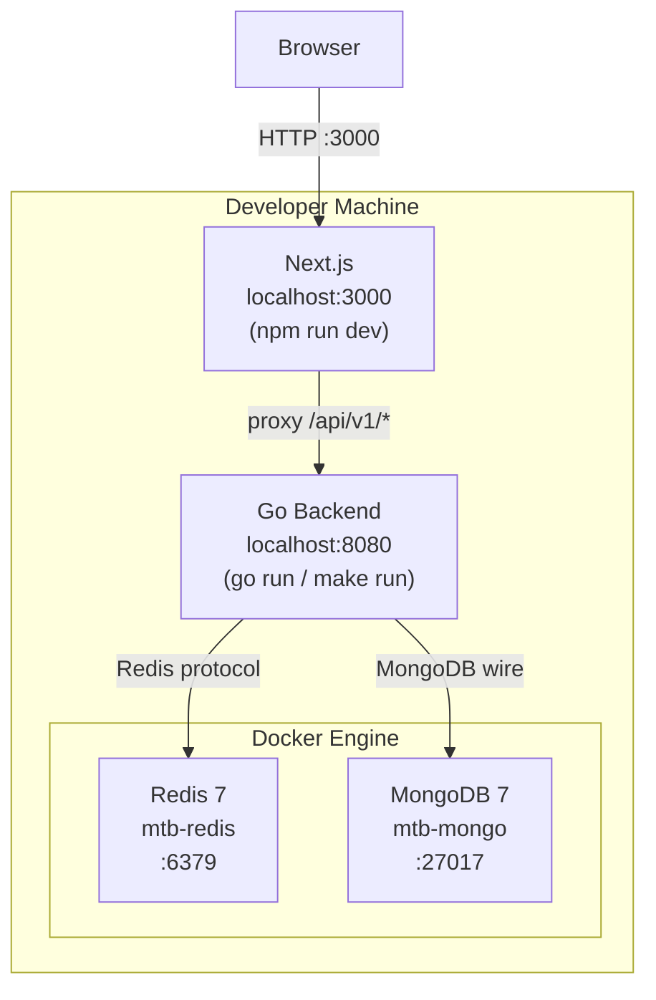
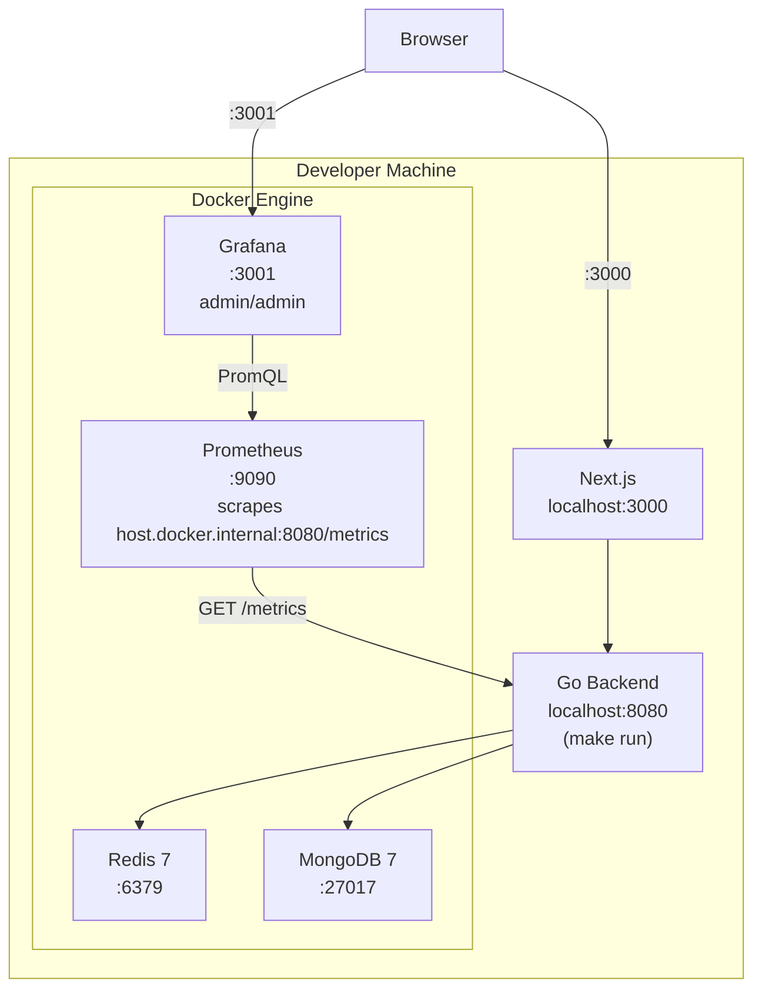
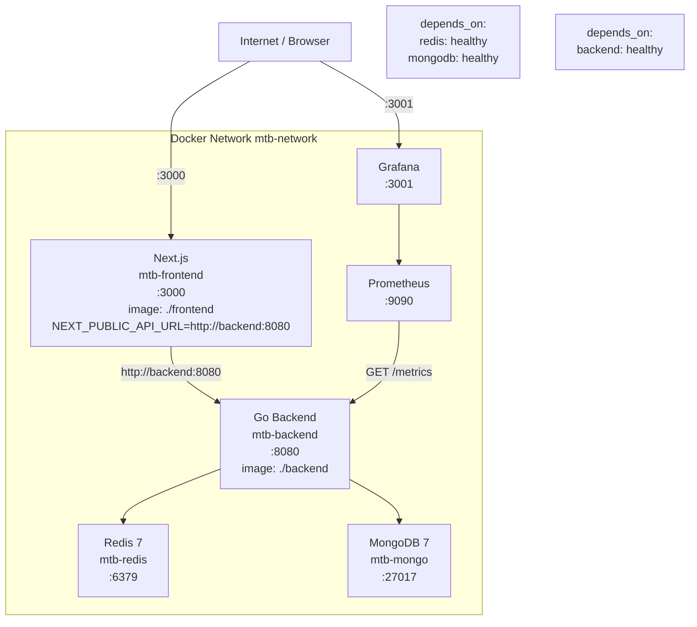
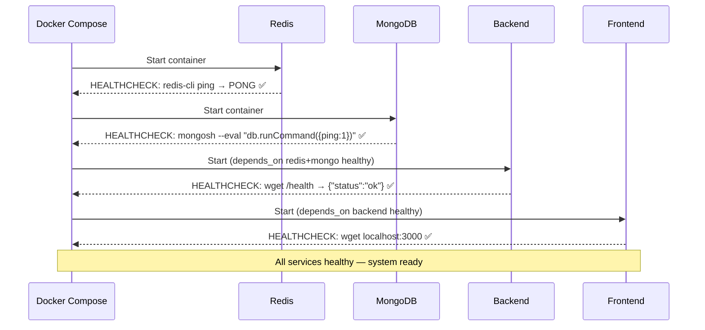

# Deployment Diagram

## Development Mode (`make dev-up`)

```mermaid
graph TB
    subgraph Developer Machine
        subgraph Docker Engine
            redis["Redis 7\nmtb-redis\n:6379"]
            mongo["MongoDB 7\nmtb-mongo\n:27017"]
        end
        backend["Go Backend\nlocalhost:8080\n(go run / make run)"]
        frontend["Next.js\nlocalhost:3000\n(npm run dev)"]
    end

    browser["Browser"]

    browser -->|HTTP :3000| frontend
    frontend -->|proxy /api/v1/*| backend
    backend -->|Redis protocol| redis
    backend -->|MongoDB wire| mongo
```

## Monitoring Mode (`make monitoring-up`)

```mermaid
graph TB
    subgraph Developer Machine
        subgraph Docker Engine
            redis["Redis 7\n:6379"]
            mongo["MongoDB 7\n:27017"]
            prometheus["Prometheus\n:9090\nscrapes host.docker.internal:8080/metrics"]
            grafana["Grafana\n:3001\nadmin/admin"]
        end
        backend["Go Backend\nlocalhost:8080\n(make run)"]
        frontend["Next.js\nlocalhost:3000"]
    end

    browser["Browser"]

    browser -->|:3000| frontend
    browser -->|:3001| grafana
    frontend --> backend
    prometheus -->|GET /metrics| backend
    grafana -->|PromQL| prometheus
    backend --> redis
    backend --> mongo
```

## Full Stack Docker (`make up`)

```mermaid
graph TB
    subgraph Docker Network mtb-network
        redis["Redis 7\nmtb-redis\n:6379"]
        mongo["MongoDB 7\nmtb-mongo\n:27017"]
        backend["Go Backend\nmtb-backend\n:8080\nimage: ./backend"]
        frontend["Next.js\nmtb-frontend\n:3000\nimage: ./frontend\nNEXT_PUBLIC_API_URL=http://backend:8080"]
        prometheus["Prometheus\n:9090"]
        grafana["Grafana\n:3001"]
    end

    internet["Internet / Browser"]

    internet -->|:3000| frontend
    internet -->|:3001| grafana
    frontend -->|http://backend:8080| backend
    backend --> redis
    backend --> mongo
    prometheus -->|GET /metrics| backend
    grafana --> prometheus

    note1["depends_on:\n  redis: healthy\n  mongodb: healthy"]
    note2["depends_on:\n  backend: healthy"]
```

## Service Health Check Chain

```mermaid
sequenceDiagram
    participant DC as Docker Compose
    participant Redis
    participant MongoDB
    participant Backend
    participant Frontend

    DC->>Redis: Start container
    Redis-->>DC: HEALTHCHECK: redis-cli ping → PONG ✅
    DC->>MongoDB: Start container
    MongoDB-->>DC: HEALTHCHECK: mongosh --eval "db.runCommand({ping:1})" ✅
    DC->>Backend: Start (depends_on redis+mongo healthy)
    Backend-->>DC: HEALTHCHECK: wget /health → {"status":"ok"} ✅
    DC->>Frontend: Start (depends_on backend healthy)
    Frontend-->>DC: HEALTHCHECK: wget localhost:3000 ✅
    Note over DC,Frontend: All services healthy — system ready
```
