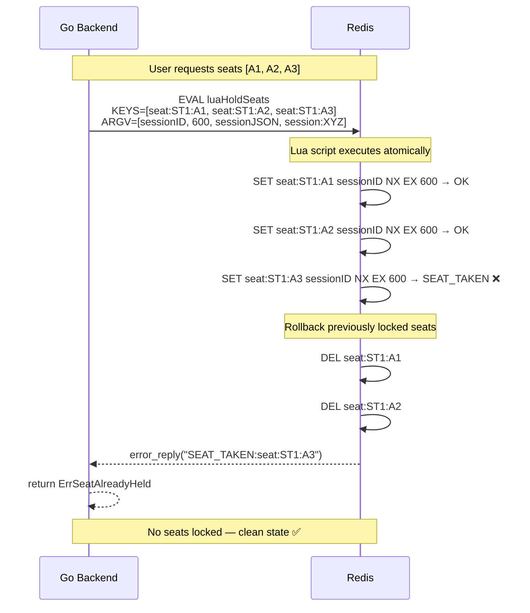
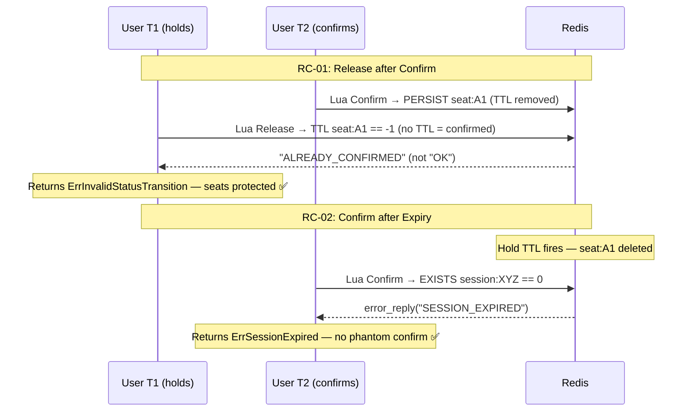
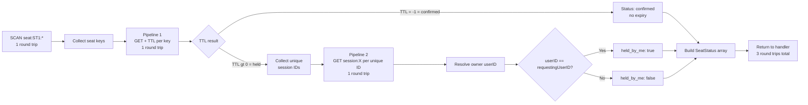

# Seat Reservation Flow

## Atomic Multi-Seat Lock (Lua Script Detail)

```mermaid
sequenceDiagram
    participant Client as Go Backend
    participant Redis

    Note over Client,Redis: User requests seats [A1, A2, A3]

    Client->>Redis: EVAL luaHoldSeats<br/>KEYS=[seat:ST1:A1, seat:ST1:A2, seat:ST1:A3]<br/>ARGV=[sessionID, 600, sessionJSON, session:XYZ]

    Note over Redis: Lua script executes atomically
    Redis->>Redis: SET seat:ST1:A1 sessionID NX EX 600 → OK
    Redis->>Redis: SET seat:ST1:A2 sessionID NX EX 600 → OK
    Redis->>Redis: SET seat:ST1:A3 sessionID NX EX 600 → SEAT_TAKEN ❌

    Note over Redis: Rollback previously locked seats
    Redis->>Redis: DEL seat:ST1:A1
    Redis->>Redis: DEL seat:ST1:A2

    Redis-->>Client: error_reply("SEAT_TAKEN:seat:ST1:A3")
    Client-->>Client: return ErrSeatAlreadyHeld

    Note over Client,Redis: No seats locked — clean state ✅
```

## Race Condition Guards

```mermaid
sequenceDiagram
    participant T1 as User T1 (holds)
    participant T2 as User T2 (confirms)
    participant Redis

    Note over T1,Redis: RC-01: Release after Confirm

    T2->>Redis: Lua Confirm → PERSIST seat:A1 (TTL removed)
    T1->>Redis: Lua Release → TTL seat:A1 == -1 (no TTL = confirmed)
    Redis-->>T1: "ALREADY_CONFIRMED" (not "OK")
    Note over T1: Returns ErrInvalidStatusTransition — seats protected ✅

    Note over T1,Redis: RC-02: Confirm after Expiry

    Note over Redis: Hold TTL fires — seat:A1 deleted
    T2->>Redis: Lua Confirm → EXISTS session:XYZ == 0
    Redis-->>T2: error_reply("SESSION_EXPIRED")
    Note over T2: Returns ErrSessionExpired — no phantom confirm ✅
```

## Seat Map Resolution (Pipelined)

```mermaid
flowchart LR
    A[SCAN seat:ST1:*\n1 round trip] --> B[Collect seat keys]
    B --> C[Pipeline 1\nGET + TTL per key\n1 round trip]
    C --> D{TTL result}
    D -- TTL gt 0 = held --> E[Collect unique\nsession IDs]
    D -- TTL = -1 = confirmed --> F[Status: confirmed\nno expiry]
    E --> G[Pipeline 2\nGET session:X per unique ID\n1 round trip]
    G --> H[Resolve owner userID]
    H --> I{userID == requestingUserID?}
    I -- Yes --> J[held_by_me: true]
    I -- No --> K[held_by_me: false]
    F --> L[Build SeatStatus array]
    J --> L
    K --> L
    L --> M[Return to handler\n3 round trips total]
```
