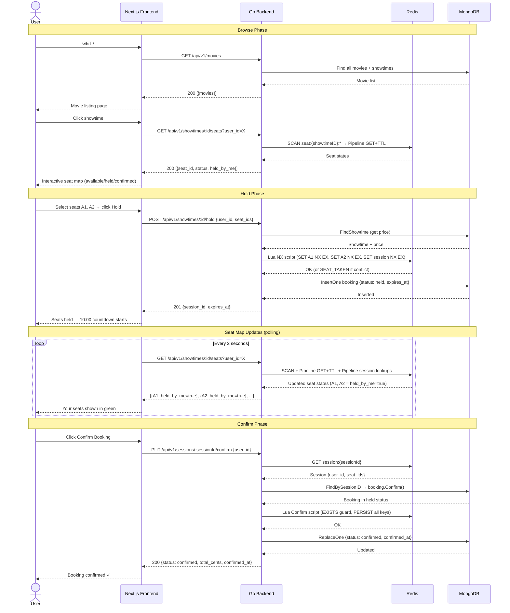

# Sequence Diagram — Full Booking Flow

```mermaid
sequenceDiagram
    actor User
    participant FE as Next.js Frontend
    participant BE as Go Backend
    participant Redis
    participant MongoDB

    Note over User,MongoDB: Browse Phase

    User->>FE: GET /
    FE->>BE: GET /api/v1/movies
    BE->>MongoDB: Find all movies + showtimes
    MongoDB-->>BE: Movie list
    BE-->>FE: 200 [{movies}]
    FE-->>User: Movie listing page

    User->>FE: Click showtime
    FE->>BE: GET /api/v1/showtimes/:id/seats?user_id=X
    BE->>Redis: SCAN seat:{showtimeID}:* → Pipeline GET+TTL
    Redis-->>BE: Seat states
    BE-->>FE: 200 [{seat_id, status, held_by_me}]
    FE-->>User: Interactive seat map (available/held/confirmed)

    Note over User,MongoDB: Hold Phase

    User->>FE: Select seats A1, A2 → click Hold
    FE->>BE: POST /api/v1/showtimes/:id/hold {user_id, seat_ids}
    BE->>MongoDB: FindShowtime (get price)
    MongoDB-->>BE: Showtime + price
    BE->>Redis: Lua NX script (SET A1 NX EX, SET A2 NX EX, SET session NX EX)
    Redis-->>BE: OK (or SEAT_TAKEN if conflict)
    BE->>MongoDB: InsertOne booking {status: held, expires_at}
    MongoDB-->>BE: Inserted
    BE-->>FE: 201 {session_id, expires_at}
    FE-->>User: Seats held — 10:00 countdown starts

    Note over User,MongoDB: Seat Map Updates (polling)
    loop Every 2 seconds
        FE->>BE: GET /api/v1/showtimes/:id/seats?user_id=X
        BE->>Redis: SCAN + Pipeline GET+TTL + Pipeline session lookups
        Redis-->>BE: Updated seat states (A1, A2 = held_by_me=true)
        BE-->>FE: [{A1: held_by_me=true}, {A2: held_by_me=true}, ...]
        FE-->>User: Your seats shown in green
    end

    Note over User,MongoDB: Confirm Phase

    User->>FE: Click Confirm Booking
    FE->>BE: PUT /api/v1/sessions/:sessionId/confirm {user_id}
    BE->>Redis: GET session:{sessionId}
    Redis-->>BE: Session {user_id, seat_ids}
    BE->>MongoDB: FindBySessionID → booking.Confirm()
    MongoDB-->>BE: Booking in held status
    BE->>Redis: Lua Confirm script (EXISTS guard, PERSIST all keys)
    Redis-->>BE: OK
    BE->>MongoDB: ReplaceOne {status: confirmed, confirmed_at}
    MongoDB-->>BE: Updated
    BE-->>FE: 200 {status: confirmed, total_cents, confirmed_at}
    FE-->>User: Booking confirmed ✓
```
